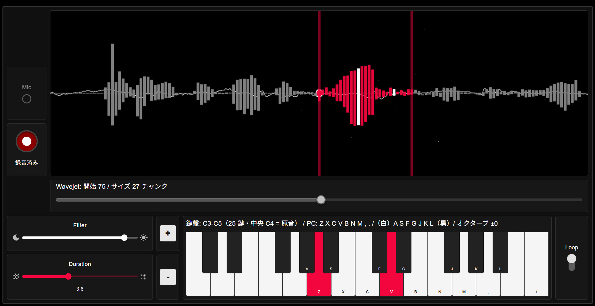

# Open Collidoscope Web App

A browser-based port of [Open Collidoscope](https://code.soundsoftware.ac.uk/projects/opencollidoscope) — an interactive granular synthesizer where you record sound, explore it visually, and play it like a musical instrument.

**Live demo:** <https://okathira-dev.github.io/opencollidoscope-web/>



This web application's author is not the author of Open Collidoscope.

## What is Collidoscope?

Official site: <http://collidoscope.io/>

> Collidoscope is driven by our vision to make digital sound and music more palpable, immediate, and magical for both performers and audience.
> Collidoscope is an interactive musical instrument developed by [Ben Bengler](http://benbengler.com/) and [Fiore Martin](http://fioremartin.com/) in March 2015. Fill it with sound and explore, and in the next moment, play and perform it like a musical instrument.

## Features

- **Granular synthesis** — record audio and play it back as grains with real-time control
- **Waveform display** — chunk-based visualization with selection, playback cursor, and filter-linked alpha
- **Piano keyboard** — mouse, PC keyboard, and Web MIDI input
- **Hardware layouts** — original and new Collidoscope UI variants (`original` / `new`), with facing, stacked, and solo player layouts
- **Loop & filter** — loop toggle/push button and cutoff filter wired to the audio graph
- **Oscilloscope** — real-time output waveform display
- **Presets** — save/load configuration as JSON
- **Mic input settings** — gain, browser processing, compressor, and post-recording normalization (Web-only extension)
- **Fullscreen** — performance-friendly full-screen mode

## Usage

1. Open the [live demo](https://okathira-dev.github.io/opencollidoscope-web/) in a modern browser (Chrome, Edge, or Firefox recommended).
2. Click **音声を開始** to initialize audio (microphone permission is required for recording).
3. Record sound, select a region on the waveform, and play with the on-screen keyboard or a connected MIDI controller.

## Development

Prerequisites: **Node.js** `^24.14.0`, **pnpm** 11 (see `packageManager` in `package.json`).

```bash
pnpm install
pnpm dev          # dev server (Vite root is src/)
pnpm check        # Biome + tsc + markdownlint
pnpm test         # Vitest
pnpm build
```

Intentional trade-offs and gaps not yet implemented are documented in [docs/web-spec.md](docs/web-spec.md) under **開発環境の意図的な選択と未整備**.

## About this repository

This repository contains:

- **`src/`** — the web application (React, TypeScript, Web Audio API, AudioWorklet)
- **`opencollidoscope/`** — a clone of the [original Open Collidoscope source](https://code.soundsoftware.ac.uk/projects/opencollidoscope) (C++/Cinder), included for reference during porting
- **`opencollidoscope_downloads/`** — a PDF mirror of the official project's **Downloads** section (build guides, MIDI reference, CAD drawing PDFs). Binaries and 3D CAD sources are excluded via `.gitignore`; see [opencollidoscope_downloads/README.md](opencollidoscope_downloads/README.md)

The original source revision referenced during development is [18:f1ff1a81be20](https://code.soundsoftware.ac.uk/projects/opencollidoscope/repository/revisions/f1ff1a81be20d31608a4002546722d839f64b31e).

## Original project

| Resource | URL |
| --- | --- |
| Official site | <http://collidoscope.io/> |
| Open Collidoscope (source & binaries) | <https://code.soundsoftware.ac.uk/projects/opencollidoscope> |
| Official Downloads | <https://code.soundsoftware.ac.uk/projects/opencollidoscope/files> |

## License

### This web application

This web application is licensed under the **GNU General Public License v3.0 or later (GPL-3.0-or-later)**, matching the original Open Collidoscope software license. See [LICENSE](LICENSE).

### Original Open Collidoscope

The original Open Collidoscope software (CollidoscopeApp, CollidoscopeTeensy, and distributed binaries) is:

- **License:** GNU General Public License v3.0 (GPL-3.0)
- **Copyright:** Queen Mary University of London
- **Authors:** Ben Bengler, Fiore Martin

Source headers and the full license text are in [`opencollidoscope/GPLv3_license.txt`](opencollidoscope/GPLv3_license.txt).

### Official Downloads (mirrored materials)

Materials in [`opencollidoscope_downloads/`](opencollidoscope_downloads/) were published separately from the source code in the official project's **Downloads** section. Their licenses differ by component:

| Component | License |
| --- | --- |
| Software source & binaries | GPL-3.0 |
| PCB designs | [CC BY-SA 3.0](https://creativecommons.org/licenses/by-sa/3.0/) (Ben Bengler) |
| 3D CAD files & build instructions | CC BY-SA 3.0 |

See [`opencollidoscope_downloads/CAD/license.txt`](opencollidoscope_downloads/CAD/license.txt) for the CAD license text.

## Documentation

| Document | Description |
| --- | --- |
| [docs/README.md](docs/README.md) | Documentation index — what to write where (single source of truth) |
| [docs/original-analysis.md](docs/original-analysis.md) | Analysis of the original C++ implementation |
| [docs/ui-mapping.md](docs/ui-mapping.md) | Electronic mapping, physical controls, Web UI gap analysis |
| [docs/web-spec.md](docs/web-spec.md) | Web version goals, features, and configuration |
| [docs/web-design.md](docs/web-design.md) | Web version architecture and porting design |
