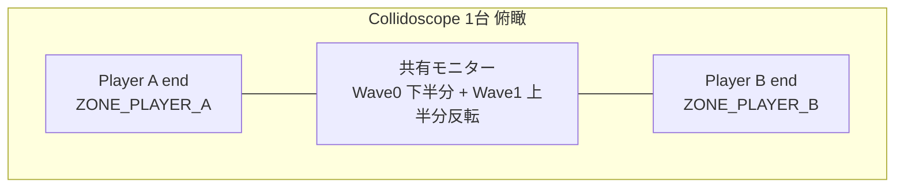
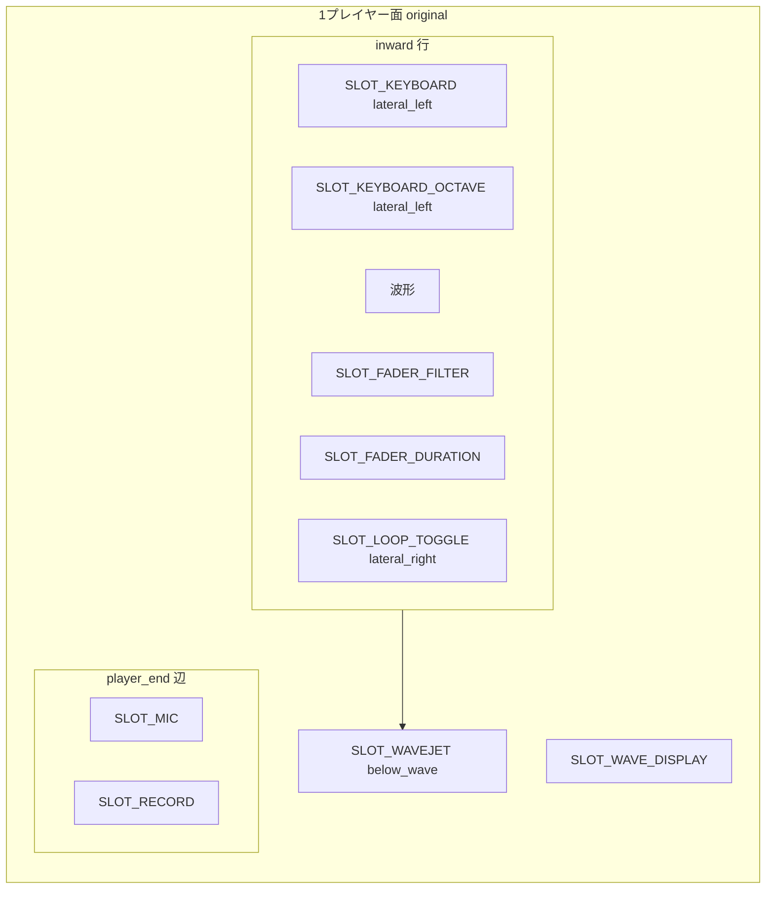

# Collidoscope 筐体レイアウト（暫定リファレンス）

ドキュメント索引・管轄: [README.md](README.md)

> **本書が書くこと**: 座標系用語、一次資料索引、暫定配置図、Web 投影メモ。  
> **本書が書かないこと**: MIDI 表・形状一覧（→ [ui-mapping.md](ui-mapping.md)）、配置の正本（→ [layout-specs/](layout-specs/README.md)）。

一次資料（PDF・CAD・動画）の索引と座標系用語のリファレンス。ゾーン・スロット位置・Web 投影は **未検証・暫定**。

**インタラクティブ図（暫定）**: Cursor Canvas `collidoscope-hardware-layout.canvas.tsx`（ローカルのみ）— 配置仕様確定後に同期予定。

## この文書の使い方

### 人間（配置仕様を作るとき）

1. 本書の **座標系**と **資料索引**で用語と一次資料の場所を確認する。
2. 資料を開いたまま [CSS Grid Wireframe Planner](https://devtooleasy.com/css/grid-wireframe-planner) で筐体俯瞰を GUI 配置する（手順は [layout-specs/README.md](layout-specs/README.md)）。
3. エクスポートした `<variant>/layout.html` を正本とし、本書の暫定図は必要に応じて更新する。

### AI エージェント向け

1. **座標系**（下記）と **資料索引**（下表）を参照する。
2. **画面上の配置**を実装するときは [layout-specs/](layout-specs/README.md) の kebab-case ブロック名を正本とする。本書の `SLOT_*` 図・`WEB_STACK_*` 表は inward 投影の解説用。
3. **MIDI 配線・形状**は [ui-mapping.md](ui-mapping.md) を参照する。
4. 俯瞰グリッドの **`-a` = 上端（`ZONE_PLAYER_A` / Wave 0 赤）、`-b` = 下端（`ZONE_PLAYER_B` / Wave 1 黄）**（一次資料画像と同じ向き）。`SLOT_*` は Web 移植層の用語。

---

## 資料の正本とバージョン

| 資料 | パス | 対象バージョン | 位置関係の信頼度 |
| --- | --- | --- | --- |
| Introduction to Collidoscope | [`Introduction to Collidoscope.pdf`](../opencollidoscope_downloads/Introduction%20to%20Collidoscope.pdf) | **両方**（Fig.1=新版, Fig.2=オリジナル） | 高（概念図・部品説明） |
| Doctor Mix 演奏動画 2015 | [Crazy Synthesizer Demo](https://www.youtube.com/watch?v=9XMfKYVu_fg), [Behind](https://www.youtube.com/watch?v=qKSkQ8ZrvG8) | **オリジナル版のみ** | 高（実機俯瞰） |
| Collidoscope Physical Build | [`Collidoscope Physical Build.pdf`](../opencollidoscope_downloads/Collidoscope%20Physical%20Build.pdf) | **新版のみ**（タイトル: *new Physical Build*） | 高（組立・パースペックス） |
| CAD 図面 | [`CAD/Drawings/`](../opencollidoscope_downloads/CAD/Drawings/) | **新版のみ**（2016-11-08, Chris Paton） | 高（寸法・部品番号） |
| MIDI / Software PDF | 同梱 PDF | 両方（入力形状の注記あり） | 中（位置はほぼ言及なし） |

**混在禁止**: オリジナル版の UI 実装に **CAD / Physical Build の部品配置だけ** を当てはめない。新版専用資料である。

---

## 座標系（用語定義）

全図は **1 プレイヤーが自分の端に立ち、画面中央を見る** ときの視点。

| 記号 | 意味 |
| --- | --- |
| `player_end` | プレイヤーが立つ外縁（短辺）。XLR マイク・録音ボタン・ループスイッチがある側 |
| `inward` | 画面 / テーブル中心方向（`player_end` の反対） |
| `lateral_left` | プレイヤーから見て左手側（演奏動画 2015 では **鍵盤側**） |
| `lateral_right` | プレイヤーから見て右手側（演奏動画 2015 では **フェーダー・トグル側**） |
| `above_wave` | 波形ディスプレイ領域（モニター上半分 or 下半分） |
| `below_wave` | 波形の直下（Wavejet 水平レール） |

デュアル筐体の長辺方向: プレイヤー A と B が **向かい合う**（`player_end` が向かい合う）。

---

## 全体構成（俯瞰）



```text
                    Player B の player_end（Wave 1 黄）
    ┌──────────────────────────────────────────────────┐
    │  [B: KB]  │     Wave 1 黄・反転表示      │ [B: 操作] │
    │───────────┼──────────────────────────────┼──────────│
    │  [A: KB]  │     Wave 0 赤・正立表示      │ [A: 操作] │
    └──────────────────────────────────────────────────┘
                    Player A の player_end（Wave 0 赤）

    ※ inward 断面図（上=B / 下=A）。俯瞰グリッド（layout-specs）の row 0 は
      資料画像どおり **上 = プレイヤー A 端（赤）**。Web 実装は 180 度投影で
      **画面下 = A 端（鍵盤帯）**、**画面上 = B 端**。

    各プレイヤー: lateral_left ≈ 鍵盤 / lateral_right ≈ パラメータ操作
    各プレイヤー: player_end 隅に XLR マイク + 録音（+ ループ on パースペックス）
```

| ゾーン ID | 説明 | Wave / MIDI ch |
| --- | --- | --- |
| `ZONE_PLAYER_A` | 一端の操作面一式 | Wave 0（赤）/ ch 1 |
| `ZONE_PLAYER_B` | 反対端の操作面一式 | Wave 1（黄）/ ch 2 |
| `ZONE_MONITOR` | 共有 21:9 モニター（アクリルで上下分割） | — |

---

## 1 プレイヤー分 — オリジナル版（Web Phase 1 の基準）

**識別子**: `hw_version=original`  
**根拠**: Introduction Fig.2, Doctor Mix 2015 動画, `CollidoscopeTeensy_original.ino`

### ゾーン配置（側面図 + 平面）

```text
  inward ↑
         ┌────────────────────────────────────────────────┐
         │  SLOT_KEYBOARD      SLOT_WAVE_DISPLAY           │
  lat_L  │  (USB MIDI KB)      (モニター半分)    lat_R      │
         │  OCT+/-             SLOT_FADER_FILTER            │
         │                      SLOT_FADER_DURATION          │
         │                      SLOT_LOOP_TOGGLE             │
         ├────────────────────────────────────────────────┤
         │           SLOT_WAVEJET (水平レール + ノブ回転)      │  below_wave
         └────────────────────────────────────────────────┘
  player_end
    [SLOT_MIC] ─────────────────────────────── [SLOT_RECORD]
```



### スロット配置（暫定・未検証）

> ゾーン・平面図は配置仕様確定まで **参考のみ**。部品名・操作軸は [ui-mapping.md](ui-mapping.md#物理コントロール形状資料ベース)、MIDI は [ui-mapping.md — 電子的対応](ui-mapping.md#電子的対応正本) を参照。

| スロット ID | ゾーン（暫定） |
| --- | --- |
| `SLOT_WAVE_DISPLAY` | `above_wave` / center |
| `SLOT_WAVEJET` | `below_wave` / full width |
| `SLOT_FADER_FILTER` | `inward` / `lateral_right` |
| `SLOT_FADER_DURATION` | `inward` / `lateral_right` |
| `SLOT_KEYBOARD` | `inward` / `lateral_left` |
| `SLOT_KEYBOARD_OCTAVE_UP` / `SLOT_KEYBOARD_OCTAVE_DOWN` | `inward` / `lateral_left`（鍵盤横） |
| `SLOT_SPEAKER` | `inward` / 鍵盤とフェーダー列の間（放音穴・非操作） |
| `SLOT_RECORD` | `player_end` |
| `SLOT_LOOP_TOGGLE` | `inward` / `lateral_right` |
| `SLOT_MIC` | `player_end` 隅 |

フェーダー 2 本の **横並び順**（`lateral_right` 内・暫定）: Filter（外側/演奏者寄り）→ Duration。

**録音・ループは `player_end`（マイク付近）**（暫定）。演奏列の中央に置かない想定。

---

## 1 プレイヤー分 — 新版

**識別子**: `hw_version=new`  
**根拠**: Introduction Fig.1, Physical Build PDF, CAD `A-1-3`/`A-1-4`/`PT-5-6`, `CollidoscopeTeensy_new.ino`

### オリジナル版との差分（物理形状のみ）

形状の詳細は [ui-mapping.md — 物理コントロール形状](ui-mapping.md#物理コントロール形状資料ベース) を参照。主な差分: フェーダー 2 本 → Vertical Mobile Knob 1 個（Wavejet と同部品・縦配置）、ループトグル → プッシュボタン、鍵盤 C3-C6。

```text
  inward ↑
         ┌────────────────────────────────────────────────┐
         │  SLOT_KEYBOARD      SLOT_WAVE_DISPLAY           │
         │                     SLOT_SHORT_KNOB             │
         │                     (上下=Filter, 回転=Duration) │
         ├────────────────────────────────────────────────┤
         │           SLOT_WAVEJET                          │
         └────────────────────────────────────────────────┘
  player_end
    [SLOT_MIC]  [SLOT_RECORD]  [SLOT_LOOP_PUSH]   ← パースペックス上
```

CAD `A-1-4` Top Plate Assembly 部品: `PT-5-5` XLR×2, `PT-5-4` ITW Loop×2, `PT-5-6` Top Perspex（録音・ループ穴）。

---

## Web 版 Phase 1 への投影

> 配置の正本は [layout-specs/original/](layout-specs/README.md)。以下は inward 視点の解説用メモ。

M2.5（オリジナル版）では `layout.css` の 12 行を **180 度回転** して Web に投影する。

- **画面上部**: プレイヤー B（黄）— 鍵盤・スライダー・Wavejet（配置のみ）
- **中央上**: `display-yellow`（Wave 1 配置枠）
- **中央下**: `display-red`（`WaveDisplay`・Wave 0）
- **画面下部**: プレイヤー A（赤）— 鍵盤・スライダー・Wavejet（A 側は配線済み）

実装: `PlayerControlSurface` + `original-layout.ts`（オリジナル）/ `new-layout.ts`（新版）。新版は zone 非依存の単一テンプレートで、B 側は `rotate(180deg)` で向き合い表示。実行時のアクティブバリアントは `uiStore.hardwareVariant`、プレイヤー配置モードは `uiStore.playerLayout`（`facing` / `stacked` / `solo`）で選択する。

### 旧暫定メモ（`ControlPanel` 横一列 — 撤去済み）

以下は M2 暫定 `ControlPanel` 時代のメモ。`SynthEngine` からは外れている。

```text
┌─────────────────────────────────────────┐  WEB_STACK_1
│  WaveDisplay（SLOT_WAVE_DISPLAY）         │
├─────────────────────────────────────────┤  WEB_STACK_2
│  SelectionRail（SLOT_WAVEJET の水平成分）│
├─────────────────────────────────────────┤  WEB_STACK_3  ControlPanel 横一列
│ Filter │ Duration │ サイズ │ Rec │ KB │ Loop │
└─────────────────────────────────────────┘
```

| 物理スロット ID | Web コンポーネント（旧暫定） |
| --- | --- |
| `SLOT_WAVEJET`（回転） | ~~`VerticalSlider`（サイズ）~~ → **UI 削除**（実機にない） |
| `SLOT_FADER_FILTER` | ~~`VerticalSlider`~~ → `HorizontalSlider` |
| `SLOT_FADER_DURATION` | ~~`VerticalSlider`~~ → `HorizontalSlider` |

---

## 実装チェックリスト（エージェント用）

- [ ] 参照資料の `hw_version` が Phase 1 方針（`original`）と一致しているか
- [ ] `hardwareVariant` / `playerLayout` を `uiStore` から読んでいるか（`SynthEngine` のローカル state に置かない）
- [ ] Wavejet 水平操作を `ControlPanel` 行に置いていないか（`SelectionRail` = `WEB_STACK_2`）
- [ ] 選択サイズを物理フェーダーと混同していないか（オリジナルは **ノブ回転**、Web は縦スライダーでメタファー）
- [ ] CAD の ITW プッシュ / Short Rail をオリジナル版のトグル・フェーダー説明に使っていないか
- [x] ループ UI — オリジナル版は **トグル**（`Switch`）、新版は **プッシュ**（`LoopPushButton`）

---

## 関連ドキュメント

- [README.md](README.md) — ドキュメント索引・管轄
- [ui-mapping.md](ui-mapping.md) — 電子的対応・形状・Web 実装状態
- [layout-specs/README.md](layout-specs/README.md) — 配置正本（`<variant>/layout.html`、kebab-case ブロック名 + `-a`/`-b`）
- [web-spec.md](web-spec.md) — Phase 1 マイルストーン・UI 方針
- [original-analysis.md](original-analysis.md) — C++ / Teensy 分析
