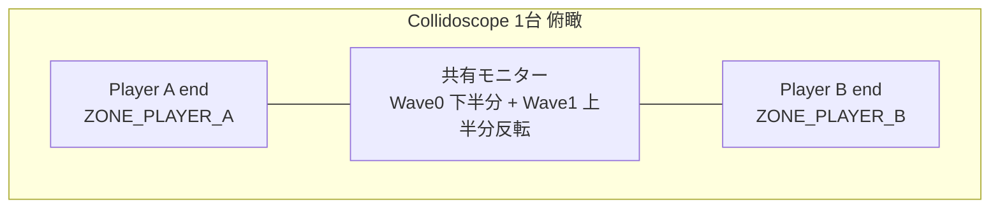
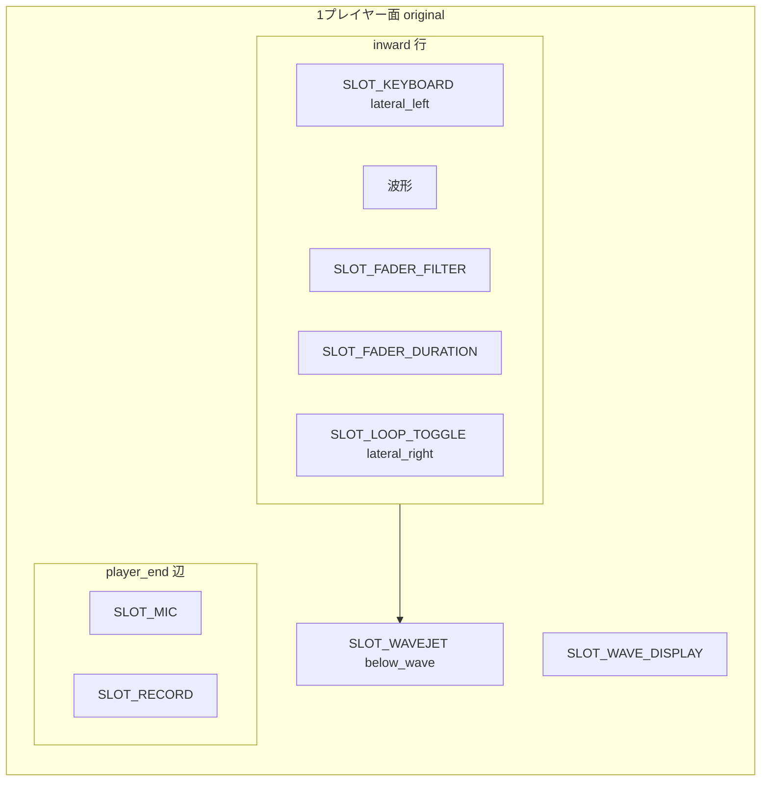

# Collidoscope 筐体レイアウト（暫定リファレンス）

> **配置（空間）**: 本書の **ゾーン・スロット位置・Web 投影** は **未検証・暫定**。実装の正本は [layout-specs/README.md](layout-specs/README.md)。
>
> **電子的つながり（MIDI・信号・Store）**: 本書には載せない。正本は [ui-mapping.md — 電子的対応](ui-mapping.md#電子的対応正本) と [original-analysis.md](original-analysis.md)（C++ / Teensy 分析・公式 MIDI PDF 突合済み）。**既存分析を当てにしてよい。**

一次資料（PDF・CAD・動画）の索引と座標系用語のリファレンス。

**インタラクティブ図（暫定）**: [collidoscope-hardware-layout.canvas.tsx](C:/Users/sardo/.cursor/projects/g-dev-opencollidoscope-web/canvases/collidoscope-hardware-layout.canvas.tsx) — ワイヤーフレーム確定後に同期予定。

## ドキュメントの管轄

| 領域 | 正本 | 信頼度 |
| --- | --- | --- |
| **筐体上の位置**（ゾーン・並び・Web 画面上のどこ） | [layout-specs/](layout-specs/README.md)（ワイヤーフレーム + YAML） | ワイヤーフレーム確定後 |
| **電子的つながり**（MIDI CC、Pitch Bend、Teensy ピン、処理式、Store キー） | [ui-mapping.md](ui-mapping.md#電子的対応正本) · [original-analysis.md](original-analysis.md) | **既存分析を正本としてよい** |
| **物理コントロールの形状・操作軸**（縦フェーダー／ノブ回転など） | [ui-mapping.md](ui-mapping.md#物理コントロール形状資料ベース) · Introduction PDF | 資料ベース（配置とは別） |
| **座標系用語**（`player_end` 等） | 本書「座標系」 | 用語定義として有効 |

## この文書の使い方（AI エージェント向け）

1. **座標系**（下記）と **資料索引**（下表）を参照する。
2. **画面上の配置**を実装するときは `docs/layout-specs/` を正本とする。本書の配置図は暫定。
3. **MIDI 配線・パラメータ処理**を実装するときは [ui-mapping.md](ui-mapping.md#電子的対応正本) を正本とする（本書のスロット表に MIDI 列は載せない）。
4. ゾーン ID（`ZONE_*`）とスロット ID（`SLOT_*`）は用語の共有用。

---

## 資料の正本とバージョン

| 資料 | パス | 対象バージョン | 位置関係の信頼度 |
| --- | --- | --- | --- |
| Introduction to Collidoscope | [`Introduction to Collidoscope.pdf`](../opencollidoscope_downloads/Introduction%20to%20Collidoscope.pdf) | **両方**（Fig.1=新版, Fig.2=オリジナル） | 高（概念図・部品説明） |
| Doctor Mix 演奏動画 2015 | [Crazy Synthesizer Demo](https://www.youtube.com/watch?v=9XMfKYVu_fg), [Behind](https://www.youtube.com/watch?v=qKSkQ8ZrvG8) | **オリジナル版のみ** | 高（実機俯瞰） |
| Collidoscope Physical Build | [`Collidoscope Physical Build.pdf`](../opencollidoscope_downloads/Collidoscope%20Physical%20Build.pdf) | **新版のみ**（タイトル: *new Physical Build*） | 高（組立・パースペックス） |
| CAD 図面 | [`CAD/Drawings/`](../opencollidoscope_downloads/CAD/Drawings/) | **新版のみ**（2016-11-08, Chris Paton） | 高（寸法・部品番号） |
| MIDI / Software PDF | 同梱 PDF | 両方（入力形状の注記あり） | 中（位置はほぼ言及なし） |

**混在禁止**: オリジナル版の UI 実装に **CAD / Physical Build の部品配置だけ** を当てはめない。新版専用資料である。

---

## 座標系（用語定義）

全図は **1 プレイヤーが自分の端に立ち、画面中央を見る** ときの視点。

| 記号 | 意味 |
| --- | --- |
| `player_end` | プレイヤーが立つ外縁（短辺）。XLR マイク・録音ボタン・ループスイッチがある側 |
| `inward` | 画面 / テーブル中心方向（`player_end` の反対） |
| `lateral_left` | プレイヤーから見て左手側（演奏動画 2015 では **鍵盤側**） |
| `lateral_right` | プレイヤーから見て右手側（演奏動画 2015 では **フェーダー・トグル側**） |
| `above_wave` | 波形ディスプレイ領域（モニター上半分 or 下半分） |
| `below_wave` | 波形の直下（Wavejet 水平レール） |

デュアル筐体の長辺方向: プレイヤー A と B が **向かい合う**（`player_end` が向かい合う）。

---

## 全体構成（俯瞰）



```text
                    Player B の player_end
    ┌──────────────────────────────────────────────────┐
    │  [B: KB]  │     Wave 1 黄・反転表示      │ [B: 操作] │
    │───────────┼──────────────────────────────┼──────────│
    │  [A: KB]  │     Wave 0 赤・正立表示      │ [A: 操作] │
    └──────────────────────────────────────────────────┘
                    Player A の player_end

    各プレイヤー: lateral_left ≈ 鍵盤 / lateral_right ≈ パラメータ操作
    各プレイヤー: player_end 隅に XLR マイク + 録音（+ ループ on パースペックス）
```

| ゾーン ID | 説明 | Wave / MIDI ch |
| --- | --- | --- |
| `ZONE_PLAYER_A` | 一端の操作面一式 | Wave 0（赤）/ ch 1 |
| `ZONE_PLAYER_B` | 反対端の操作面一式 | Wave 1（黄）/ ch 2 |
| `ZONE_MONITOR` | 共有 21:9 モニター（アクリルで上下分割） | — |

---

## 1 プレイヤー分 — オリジナル版（Web Phase 1 の基準）

**識別子**: `hw_version=original`  
**根拠**: Introduction Fig.2, Doctor Mix 2015 動画, `CollidoscopeTeensy_original.ino`

### ゾーン配置（側面図 + 平面）

```text
  inward ↑
         ┌────────────────────────────────────────────────┐
         │  SLOT_KEYBOARD      SLOT_WAVE_DISPLAY           │
  lat_L  │  (USB MIDI KB)      (モニター半分)    lat_R      │
         │                      SLOT_FADER_FILTER            │
         │                      SLOT_FADER_DURATION          │
         │                      SLOT_LOOP_TOGGLE             │
         ├────────────────────────────────────────────────┤
         │           SLOT_WAVEJET (水平レール + ノブ回転)      │  below_wave
         └────────────────────────────────────────────────┘
  player_end
    [SLOT_MIC] ─────────────────────────────── [SLOT_RECORD]
```



### スロット配置（暫定・未検証）

> ゾーン・平面図はワイヤーフレーム確定まで **参考のみ**。部品名・操作軸は [ui-mapping.md](ui-mapping.md#物理コントロール形状資料ベース)、MIDI は [ui-mapping.md — 電子的対応](ui-mapping.md#電子的対応正本) を参照。

| スロット ID | ゾーン（暫定） |
| --- | --- |
| `SLOT_WAVE_DISPLAY` | `above_wave` / center |
| `SLOT_WAVEJET` | `below_wave` / full width |
| `SLOT_FADER_FILTER` | `inward` / `lateral_right` |
| `SLOT_FADER_DURATION` | `inward` / `lateral_right` |
| `SLOT_KEYBOARD` | `inward` / `lateral_left` |
| `SLOT_RECORD` | `player_end` |
| `SLOT_LOOP_TOGGLE` | `inward` / `lateral_right` |
| `SLOT_MIC` | `player_end` 隅 |

フェーダー 2 本の **横並び順**（`lateral_right` 内・暫定）: Filter（外側/演奏者寄り）→ Duration。

**録音・ループは `player_end`（マイク付近）**（暫定）。演奏列の中央に置かない想定。

---

## 1 プレイヤー分 — 新版

**識別子**: `hw_version=new`  
**根拠**: Introduction Fig.1, Physical Build PDF, CAD `A-1-3`/`A-1-4`/`PT-5-6`, `CollidoscopeTeensy_new.ino`

### オリジナル版との差分（物理形状のみ・資料ベース）

> MIDI マッピングは両バージョン同一。電子的対応は [ui-mapping.md — 電子的対応](ui-mapping.md#電子的対応正本) を参照。

| スロット ID | オリジナル（物理形状） | 新版（物理形状） |
| --- | --- | --- |
| `SLOT_FADER_FILTER` | 縦フェーダー | **`SLOT_SHORT_KNOB`**（縦ストリップ + ノブ上下） |
| `SLOT_FADER_DURATION` | 縦フェーダー | **同ノブ回転** |
| `SLOT_LOOP_TOGGLE` | トグル | **`SLOT_LOOP_PUSH`**（48m-ss プッシュ） |
| `SLOT_WAVEJET` | 同左 | 同左（長尺レール `PT-3-*`） |
| `SLOT_RECORD` / `SLOT_MIC` | 同左 | 同左（パースペックス `PT-5-6`, `PT-6-2`） |

```text
  inward ↑
         ┌────────────────────────────────────────────────┐
         │  SLOT_KEYBOARD      SLOT_WAVE_DISPLAY           │
         │                     SLOT_SHORT_KNOB             │
         │                     (上下=Filter, 回転=Duration) │
         ├────────────────────────────────────────────────┤
         │           SLOT_WAVEJET                          │
         └────────────────────────────────────────────────┘
  player_end
    [SLOT_MIC]  [SLOT_RECORD]  [SLOT_LOOP_PUSH]   ← パースペックス上
```

CAD `A-1-4` Top Plate Assembly 部品: `PT-5-5` XLR×2, `PT-5-4` ITW Loop×2, `PT-5-6` Top Perspex（録音・ループ穴）。

---

## Web 版 Phase 1 への投影（暫定）

> **本節全体は未検証・暫定。** 正本は [layout-specs/README.md](layout-specs/README.md)。MIDI / Store の配線は [ui-mapping.md](ui-mapping.md#電子的対応正本) を参照（配置とは別）。

Phase 1 は **単一エンジン（Wave 0）** を画面中央に縦積み。以下は M2 暫定 `ControlPanel` 時代のメモであり、ワイヤーフレーム確定後に置き換える。

### 画面スタック（上 → 下・暫定）

```text
┌─────────────────────────────────────────┐  WEB_STACK_1
│  WaveDisplay（SLOT_WAVE_DISPLAY）         │
├─────────────────────────────────────────┤  WEB_STACK_2
│  SelectionRail（SLOT_WAVEJET の水平成分）│
├─────────────────────────────────────────┤  WEB_STACK_3  ControlPanel 横一列
│ Filter │ Duration │ サイズ │ Rec │ KB │ Loop │
└─────────────────────────────────────────┘
```

### 物理スロット → Web コンポーネント（配置・暫定）

| 物理スロット ID | Web コンポーネント | 画面位置（暫定） |
| --- | --- | --- |
| `SLOT_WAVE_DISPLAY` | `WaveDisplay` | `WEB_STACK_1` |
| `SLOT_WAVEJET`（水平） | `SelectionRail` | `WEB_STACK_2` |
| `SLOT_WAVEJET`（回転） | `VerticalSlider`（ラベル: サイズ） | `WEB_ROW_3` |
| `SLOT_FADER_FILTER` | `VerticalSlider`（Filter） | `WEB_ROW_1` |
| `SLOT_FADER_DURATION` | `VerticalSlider`（Duration） | `WEB_ROW_2` |
| `SLOT_RECORD` | `RecordButton` | `WEB_ROW_4` |
| `SLOT_KEYBOARD` | `PianoKeyboard` | `WEB_ROW_5` |
| `SLOT_LOOP_TOGGLE` | `Switch`（トグル） | `WEB_ROW_6` |

### Web 横一列の順序（`WEB_ROW_*` = 左から右）

```text
WEB_ROW_1 Filter → WEB_ROW_2 Duration → WEB_ROW_3 サイズ → WEB_ROW_4 Record → WEB_ROW_5 Keyboard → WEB_ROW_6 Loop
```

`ControlPanel.tsx` の `flexDirection: row` はこの順序に合わせる。Filter / Loop は M3 までプレースホルダ可。

**意図的な差異**: 物理では録音・ループは `player_end`（マイク端）だが、Web では操作列内にまとめる。プレイヤー端の再現が必要なら `RecordButton` を `WEB_ROW_6` 右外または列端に寄せる設計を検討（現状は中央寄り）。

---

## バージョン別コントロール形状（クイック参照・資料ベース）

物理入力の形状差。MIDI は共通 → [ui-mapping.md — 電子的対応](ui-mapping.md#電子的対応正本)。

| パラメータ | オリジナル `hw_version=original` | 新版 `hw_version=new` |
| --- | --- | --- |
| Filter | `SLOT_FADER_FILTER` 縦フェーダー | `SLOT_SHORT_KNOB` 上下 |
| Duration | `SLOT_FADER_DURATION` 縦フェーダー | `SLOT_SHORT_KNOB` 回転 |
| 選択開始 | `SLOT_WAVEJET` 水平 | 同左 |
| 選択サイズ | `SLOT_WAVEJET` ノブ回転 | 同左 |
| ループ | `SLOT_LOOP_TOGGLE` | `SLOT_LOOP_PUSH` |
| 録音 | `SLOT_RECORD` | 同左 |

---

## 実装チェックリスト（エージェント用）

- [ ] 参照資料の `hw_version` が Phase 1 方針（`original`）と一致しているか
- [ ] Wavejet 水平操作を `ControlPanel` 行に置いていないか（`SelectionRail` = `WEB_STACK_2`）
- [ ] 選択サイズを物理フェーダーと混同していないか（オリジナルは **ノブ回転**、Web は縦スライダーでメタファー）
- [ ] CAD の ITW プッシュ / Short Rail をオリジナル版のトグル・フェーダー説明に使っていないか
- [ ] ループ UI がオリジナル版では **トグル**（新版は将来プッシュバリアント）

---

## 関連ドキュメント

- [ui-mapping.md](ui-mapping.md) — **電子的対応（正本）**・Web 版機能対応
- [layout-specs/README.md](layout-specs/README.md) — **配置（正本・予定）**
- [web-spec.md](web-spec.md) — Phase 1 マイルストーン・UI 方針
- [original-analysis.md](original-analysis.md) — C++ / Teensy 分析（電子的つながりの詳細）
