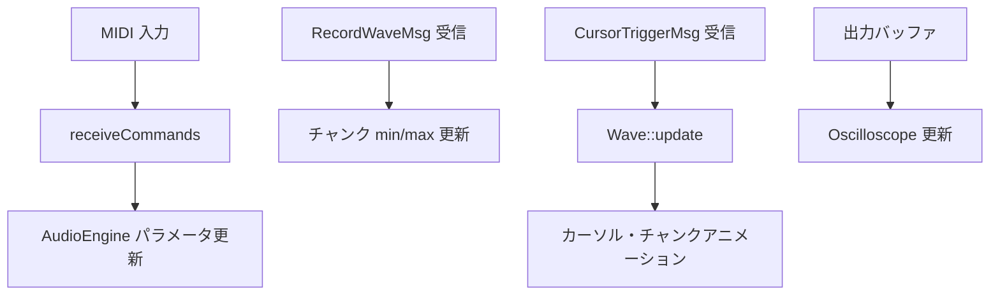
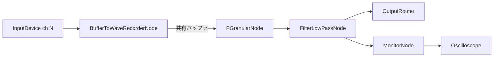

# Open Collidoscope オリジナル実装分析

本ドキュメントは、リポジトリ同梱の C++/Cinder 実装（`opencollidoscope/`）と公式 Downloads（`opencollidoscope_downloads/`）を読み解いた結果をまとめたものです。Web版の実装方針は [web-spec.md](web-spec.md) と [web-design.md](web-design.md) を参照してください。

## Collidoscope とは

- 公式サイト: <http://collidoscope.io/>
- オープンソース: <https://code.soundsoftware.ac.uk/projects/opencollidoscope>
- 開発者: Ben Bengler, Fiore Martin（2015年）

> Collidoscope is an interactive musical instrument. Fill it with sound and explore, and in the next moment, play and perform it like a musical instrument.

録音した音をチャンク単位で視覚化し、選択範囲からグラニュラーシンセシスでリアルタイム演奏する楽器です。

### ハードウェア構成

| 要素 | 役割 |
| --- | --- |
| Raspberry Pi | C++/Cinder アプリ実行、画面表示、音声 I/O |
| Teensy マイクロコントローラー | 物理コントローラー（スライダー、エンコーダー、ボタン）を MIDI に変換 |
| 物理インターフェース | 2人が向かい合って演奏するためのデュアル操作面 |

1台の Collidoscope は **2つの完全に独立した音声処理システム** で構成されます。各システムは独自の録音バッファ、グラニュラーシンセ、フィルター、波形表示、MIDI チャンネルを持ちます。

### 物理ハードウェア

公式資料（`opencollidoscope_downloads/`）に基づく筐体・部品の概要。Web 版 UI の基準は **オリジナル版**（縦スライダー + トグルスイッチ）とする。

#### 筐体構成

| 要素 | 内容 |
| --- | --- |
| フレーム | 30mm × 30mm アルミ押出材 + アングルブラケット |
| スライダーレール | 8mm クロムスライダーロッド、3D プリント製ハウジング |
| 木製パネル | 3mm 合板レーザーカット積層（ヒンジ付き側面で輸送時折りたたみ可） |
| 前面オーバーレイ | アクリル（パースペックス）— 録音・ループスイッチ取り付け、画面とフラッシュ |
| ディスプレイ | 1 台のモニターをアクリルで上下 2 分割表示（Wave 0 下半分 / Wave 1 上半分反転） |

組み立て手順（**新版のみ**）: [`opencollidoscope_downloads/Collidoscope Physical Build.pdf`](../opencollidoscope_downloads/Collidoscope%20Physical%20Build.pdf)  
位置関係の正本（両バージョン・Web 投影）: [hardware-layout.md](hardware-layout.md)

#### 電子部品

| 部品 | 型式・備考 | 役割 |
| --- | --- | --- |
| Raspberry Pi 3 Model B | Raspbian Jessie | `CollidoscopeApp` 実行、HDMI 表示、USB MIDI 受信 |
| Teensy++ 2.0 | USB MIDI デバイス | センサー読み取り → MIDI 送出（`CollidoscopeTeensy`） |
| Focusrite Scarlett 2i2 | USB オーディオ IF | マイク入力 2ch、スピーカー出力 2ch（JACK 経由） |
| マイク | IMG Stage Line DMG700（XLR グースネック） | 録音入力（カーディオイド） |
| USB MIDI キーボード | 汎用クラスコンプライアント | ノート演奏、オクターブ切替 |
| モニター | オリジナル版: LG 21:9 25UM65 / 新版: Dell 29 UltraSharp | 波形・オシロスコープ表示 |

#### ハードウェア 2 バージョン

MIDI メッセージと `CollidoscopeApp` の処理は両バージョンで同一。差異は**物理コントロールの形状**のみ。

| パラメータ | オリジナル版 | 新版 | Teensy ファームウェア |
| --- | --- | --- | --- |
| フィルター | 縦スライダー（太陽/月アイコン） | 縦ストリップセンサー（ノブ上下） | `original.ino` / `new.ino` |
| Duration | 縦スライダー（粒/雲アイコン） | ロータリーエンコーダー（ノブ回転） | 同上 |
| ループ | 12V トグルフリックスイッチ | 48m-ss ソリッドステートプッシュボタン | 同上 |
| 選択位置・サイズ | Wavejet（共通） | 同左 | 同上 |

#### Wavejet（選択コントロール）

波形直下の水平レール上を移動する複合コントロール:

| 部品 | 型式 | 役割 |
| --- | --- | --- |
| ストリップセンサー | Spectra Symbol SP-L-0200-103（200mm SoftPot） | 水平位置 → Pitch Bend（選択開始 0〜149） |
| ロータリーエンコーダー | Bourns PEC11R-4025F（25mm シャフト） | ノブ回転 → CC1（選択サイズ 1〜37） |
| ワイパー | Spectra Symbol WP-M1-01-03-014-DI | ストリップセンサーへの圧力接触 |
| アルミノブ | 38mm ストローハット型 | エンコーダーシャフトに装着 |

#### その他の物理コントロール（1 プレイヤー分）

俯瞰図・スロット ID・Web 版投影は [hardware-layout.md](hardware-layout.md)（**配置は暫定**）と [layout-specs/](layout-specs/README.md)（**配置の正本・予定**）を参照。電子的対応（MIDI）は下記「MIDI 制御」。

| スロット ID | 部品（オリジナル版 / 新版） | 操作軸 |
| --- | --- | --- |
| `SLOT_FADER_FILTER` | Bourns 縦フェーダー（太陽/月）/ Short Knob 上下 | 縦 |
| `SLOT_FADER_DURATION` | Bourns 縦フェーダー（粒/雲）/ 同ノブ回転 | 縦 / 回転 |
| `SLOT_WAVEJET` | SoftPot + エンコーダー + 38mm ノブ | 水平=開始、回転=サイズ |
| `SLOT_RECORD` | 16mm 赤プッシュ（LED リング） | 押下 |
| `SLOT_KEYBOARD` | USB MIDI キーボード | — |
| `SLOT_LOOP_TOGGLE` / `SLOT_LOOP_PUSH` | 12V トグル / 48m-ss プッシュ | フリック / 押下 |

#### Teensy ピン配線（Wave 1 = 赤 / ch 1）

Introduction to Collidoscope より。Wave 2（黄 / ch 2）は F1, F4, INT2/3, INT6/7, B3, B4, D5 が対応。

| センサー | Teensy ピン | オリジナル版 | 新版 |
| --- | --- | --- | --- |
| 選択開始（Strip） | F0 | Wavejet 水平 | 同左 |
| フィルター | F2 | 縦フェーダー | 縦ストリップセンサー |
| Duration | F3 | 縦フェーダー | —（INT4/INT5 へ） |
| 選択サイズ | INT0/INT1 | エンコーダー | 同左 |
| Duration | INT4/INT5 | — | エンコーダー |
| ループ | B0 | トグルスイッチ | プッシュボタン |
| 録音 | B1 | プッシュボタン | 同左 |
| 録音 LED | D4 | LED リング | 同左 |

## ソースコード構造

```text
opencollidoscope/
├── CollidoscopeApp/          # メインアプリケーション
│   ├── include/              # ヘッダ（PGranular, Wave, Config 等）
│   ├── src/                  # 実装
│   └── linux/CMakeLists.txt  # ビルド定義（NUM_WAVES=2, USE_PARTICLES）
├── CollidoscopeTeensy/       # Teensy ファームウェア（MIDI 出力）
├── JackDevice/               # JACK オーディオバックエンド
└── pcb/                      # 回路基板データ
```

### 主要モジュール

| モジュール | ファイル | 役割 |
| --- | --- | --- |
| `CollidoscopeApp` | `CollidoscopeApp.cpp` | アプリ初期化、フレームループ、MIDI マッピング、描画 |
| `AudioEngine` | `AudioEngine.cpp` | 波形ごとの Cinder オーディオグラフ構築・制御 |
| `PGranular` | `PGranular.h` | グラニュラーシンセシス核心（ヘッダオンリー） |
| `PGranularNode` | `PGranularNode.cpp` | PGranular の Cinder ノードラッパー、ボイス管理 |
| `BufferToWaveRecorderNode` | `BufferToWaveRecorderNode.cpp` | 録音、チャンク min/max 計算 |
| `Wave` / `Chunk` | `Wave.cpp`, `Chunk.cpp` | 波形・チャンクの視覚表示 |
| `MIDI` | `MIDI.cpp` | RtMidi による入力受信 |
| `Config` | `Config.cpp` | ランタイム設定 |
| `Oscilloscope` | `Oscilloscope.h` | 出力波形のリアルタイム表示 |
| `ParticleController` | `ParticleController.cpp` | パーティクル演出 |
| `EnvASR` | `EnvASR.h` | Attack-Sustain-Release エンベロープ |
| `Messages` | `Messages.h` | オーディオスレッド ↔ GUI スレッド間メッセージ |

## アプリケーションライフサイクル

### 初期化（`setup`）

1. 波形ごとのメッセージバッファ確保
2. `AudioEngine::setup(Config)` — 2波形分のオーディオグラフ構築
3. `setupGraphics()` — `Wave`, `DrawInfo`, `Oscilloscope` を波形ごとに生成
4. `mSecondsPerChunk = waveLen / numChunks`（デフォルト 2.0 / 150 ≈ 13.3ms）
5. `MIDI::setup()` — 全 MIDI 入力ポートを開く

XML 設定ファイルの読み込みは実装されているが、`setup()` では呼ばれていません。デフォルトは `Config()` コンストラクタの値です。

### フレーム更新（`update`）



### 描画（`draw`）

- 背景を黒でクリア
- Wave 0（赤）: 画面下半分、通常描画
- Wave 1（黄）: 画面上半分、**水平反転**（`rotate(π, Y)`）— 向かい合う 2 人演奏向け

## 音声パイプライン

波形ごとに以下のグラフが独立して存在します。



- Wave 0: ステレオ入力 ch 0、出力 ch 0
- Wave 1: ステレオ入力 ch 1、出力 ch 1

### 録音（`BufferToWaveRecorderNode`）

| 項目 | 値 |
| --- | --- |
| バッファ長 | `waveLen × sampleRate`（デフォルト 2.0秒 = 88,200 サンプル @ 44.1kHz） |
| チャンク数 | 150 |
| サンプル/チャンク | `round(bufferFrames / numChunks)` = 588 |
| フェード | 録音開始・終了に 20ms リニアランプ（クリック防止） |
| チャンクデータ | 各チャンク区間の min/max 振幅を `WAVE_CHUNK` メッセージで GUI に送信 |

録音バッファは **再生用にも共有** されます。`PGranular` は同じバッファを読み取ります。

### グラニュラーシンセシス（`PGranular`）

SuperCollider の TGrains と Ross Bencina の "Implementing Real-Time Granular Synthesis" に基づく実装です。

#### 選択モデル

| パラメータ | 意味 |
| --- | --- |
| `mGrainsStart` | 選択開始位置（サンプル単位） |
| `mTriggerRate` | グレイン再トリガー間隔 = **選択サイズ（サンプル）** |
| `mGrainsDuration` | `selectionSize × durationCoeff`（最小 640 サンプル） |
| `mGrainsDurationCoeff` | 1.0〜8.0。1 より大きいとグレインが重なり、テクスチャが変化 |

チャンク ↔ サンプル変換:

```text
samplesPerChunk = waveLen × sampleRate / numChunks
selectionStartSamples = startChunk × samplesPerChunk
selectionSizeSamples = numChunks × samplesPerChunk
```

#### グレイン（`PGrain`）

```cpp
struct PGrain {
    double phase;      // 読み取り位置
    double rate;       // 再生レート（ピッチ）
    bool alive;
    size_t age, duration;
    double b1, y1, y2; // raised cosine bell エンベロープ状態
};
```

- 最大同時グレイン数: **32**（`kMaxGrains`）
- 新グレイン開始位置: `mGrainsStart + randOffset`（バッファ長でラップ）
- ランダムオフセット: 最大 `sampleRate / 100`（約 10ms）

#### グレイン合成アルゴリズム

1. **線形補間**: `interpolateLin(buffer[i], buffer[i+1], fraction)`
2. **Raised cosine bell**（Hann 窓の再帰計算）:
   - `w = π / duration`
   - `b1 = 2 × cos(w)`, `y1 = sin(w)`, `y2 = 0`
   - 各サンプル: `y0 = b1 × y1 - y2`（状態更新して y1, y2 をシフト）
3. **出力**: `sample × bell × ASR_envelope × attenuation`
4. グレインは `age == duration` で死亡。生存グレインは配列先頭にコンパクト化

#### トリガーとループ

- `mTrigger` が `mTriggerRate` ごとに新グレインを生成
- 選択範囲の端に達すると `phase` がバッファ先頭にラップ（ループ再生）
- 新グレイン生成時にコールバック `'t'`、エンベロープ idle 時に `'e'`

#### ASR エンベロープ（`EnvASR`）

| パラメータ | 値 |
| --- | --- |
| Attack | 10ms |
| Sustain | 1.0 |
| Release | 50ms |
| アテニュエーション | 0.25118864315096（-12dB） |

`noteOn()` で Attack 開始、`noteOff()` で Release。Release 完了後 idle。

#### ボイス管理（`PGranularNode`）

各波形につき:

| ボイス | 数 | 用途 |
| --- | --- | --- |
| ループ | 1（ID = -1） | ループ再生（`LOOP_ON/OFF`） |
| ノート | 最大 6 | MIDI ノートオン/オフ |

- `NOTE_ON`: 同一 MIDI ノートが既に鳴っていれば再アタック、なければ空きスロットに割り当て
- `NOTE_OFF`: 該当ノートの `noteOff()`
- ピッチ: MIDI 60（中央 C）= rate 1.0、12 平均律

### フィルター

- `FilterLowPassNode`、Q = 0.707（Butterworth）
- カットオフ: 200Hz〜22050Hz
- MIDI CC7 で指数的に制御: `pow(maxCutoff/200, midiVal/127) × minCutoff`
- 同時に選択ハイライトの透明度を更新: `alpha = lmap(midiVal, 0, 127, 0, 1)` → 描画時 `0.5 + alpha × 0.5`

**MIDI 値とカットオフ（コード上の正）**: `midiVal=0` → 200Hz（最大カット、選択は暗い）、`midiVal=127` → 22050Hz（フィルターなし、選択は明るい）。

公式 MIDI リファレンス PDF はフェーダーの**物理位置**（太陽側 = 明るい音）で記述している。オリジナル版 Teensy は `map(analog, 0, 1024, 0, 127)` でフェーダー位置をそのまま MIDI 値に変換するため、PDF の「物理位置 → 周波数」とコードの「MIDI 値 → 周波数」は座標系が異なる場合がある。Web 版は **CollidoscopeApp の式**を正とする。

**物理入力（バージョン別）**: オリジナル版 = 縦スライダー（太陽/月アイコン）、新版 = 縦ストリップセンサー（ノブ上下）。

## チャンク・波形システム

### Chunk

| 定数 | 値 |
| --- | --- |
| `kWidth` | 7px |
| チャンク間隔 | 9px（幅 7 + 余白 2） |

各チャンクは録音区間の **min/max 振幅** を縦バーとして描画。出現時に 3 フレーム程度のポップアップアニメーション。

### Wave / Selection

| 項目 | 説明 |
| --- | --- |
| 選択開始 | チャンクインデックス（0〜149） |
| 選択サイズ | チャンク数（1〜37、inclusive） |
| 選択色 | Wave 0: 赤 `#F3063E`、Wave 1: 黄 `#FFCC00` |
| カーソル色 | 白 |
| `mParticleSpread` | グレイン duration coeff と連動（1〜8） |

カーソルは `elapsed / secondsPerChunk` で選択範囲内を移動。`PGranular` のトリガーコールバック `'t'` で生成、`'e'` で削除。

### DrawInfo

- `mSelectionBarHeight = windowHeight / NUM_WAVES`（画面を縦 2 分割）
- 波形バーは各半分の高さの 3/5 を使用

## MIDI 制御

> **電子的つながりの正本**。C++ `CollidoscopeApp`・Teensy ファームウェア・公式 MIDI PDF に基づく既存分析を **当てにしてよい**。Web 実装・M2.5 バリアント切替でもこのマッピングは変えない。物理入力の形状差は [ui-mapping.md — 物理コントロール形状](ui-mapping.md#物理コントロール形状資料ベース) を参照。

MIDI チャンネル = 波形インデックス（ch 1 → Wave 0 赤、ch 2 → Wave 1 黄）。公式資料では engine 1/2 と表記。

Teensy ファームウェア（`CollidoscopeTeensy_original.ino` / `CollidoscopeTeensy_new.ino`）は同一 MIDI マッピングを出力。

| スロット / 信号 | MIDI | マッピング（`CollidoscopeApp`） |
| --- | --- | --- |
| `SLOT_KEYBOARD` | Note On/Off | ピッチ付きグレイン再生（最大 6 ボイス） |
| `SLOT_WAVEJET`（水平） | Pitch Bend 0〜149 | 選択開始位置（チャンクインデックス） |
| `SLOT_WAVEJET`（回転） | CC 1 | 選択サイズ（MIDI 0〜127 → 1〜37 チャンク） |
| `SLOT_FADER_DURATION` / 新版ノブ回転 | CC 2 | グレイン持続係数（0〜127 → 1.0〜8.0） |
| `SLOT_LOOP_TOGGLE` / `SLOT_LOOP_PUSH` | CC 4 | ループ ON（>0）/ OFF（0） |
| `SLOT_RECORD` | CC 5 | 録音トリガー |
| `SLOT_FADER_FILTER` / 新版ノブ上下 | CC 7 | フィルターカットオフ + 選択範囲の透明度 |

Pitch Bend と CC7 はセンサノイズ対策のため、波形ごとに最新値のみ保持（重複除去）。

## 視覚システム

### オシロスコープ

- 出力モニターバッファを 1/4 にダウンサンプルして描画
- 振幅 × 0.8 をウィンドウ高さにマッピング
- Wave 1 は X/Y 反転

### パーティクル（`USE_PARTICLES` ビルド時）

| 定数 | 値 |
| --- | --- |
| `kMaxParticles` | 150 |
| `kMaxParticleAdd` | 22（1 トリガーあたり最大） |
| `PARTICLESIZE_COEFF` | 40 |

- `particleSpread > 1` のときカーソル更新で生成
- 選択範囲内のランダム位置、寿命 30〜60 フレーム
- フィルター係数に応じて量が変化

## 2 波形システム

ビルド時に `-DNUM_WAVES=2` が定義されます。

```cpp
array<shared_ptr<Wave>, NUM_WAVES> mWaves;
array<PGranularNodeRef, NUM_WAVES> mPGranularNodes;
array<FilterLowPassNodeRef, NUM_WAVES> mLowPassFilterNodes;
array<MIDIMessage, NUM_WAVES> mPitchBendMessages;
```

| 属性 | Wave 0 | Wave 1 |
| --- | --- | --- |
| 色 | 赤 `#F3063E` | 黄 `#FFCC00` |
| 入力チャンネル | 0 | 1 |
| 画面位置 | 下半分 | 上半分（反転） |
| MIDI チャンネル | 0 | 1 |

## クロススレッド通信

| メッセージ | 方向 | 内容 |
| --- | --- | --- |
| `RecordWaveMsg` | Audio → GUI | `WAVE_START`, `WAVE_CHUNK(index, min, max)` |
| `CursorTriggerMsg` | Audio → GUI | `TRIGGER_UPDATE/END(synthID)` |
| `NoteMsg` | GUI → Audio | `NOTE_ON/OFF`, `LOOP_ON/OFF` + rate |

`RingBufferPack` によるリングバッファでスレッド間通信。

## 主要定数一覧

### Config デフォルト

| パラメータ | デフォルト |
| --- | --- |
| `mNumChunks` | 150 |
| `mWaveLen` | 2.0 秒 |
| `getMaxSelectionNumChunks()` | 37 |
| `getMaxKeyboardVoices()` | 6 |
| `getMaxGrainDurationCoeff()` | 8.0 |
| `getMinFilterCutoffFreq()` | 200 Hz |
| `getMaxFilterCutoffFreq()` | 22050 Hz |
| `getOscilloscopeNumPointsDivider()` | 4 |
| `getCursorTriggerMessageBufSize()` | 512 |

### PGranular 定数

| パラメータ | 値 |
| --- | --- |
| `kMaxGrains` | 32 |
| `kMinGrainsDuration` | 640 サンプル |
| ASR Attack / Release | 10ms / 50ms |
| アテニュエーション | -12dB（0.25118864315096） |

### 44.1kHz での派生値

| 量 | 値 |
| --- | --- |
| バッファサンプル数 | 88,200 |
| サンプル/チャンク | 588 |
| 秒/チャンク | ≈ 13.3ms |
| 最大選択サンプル数 | 37 × 588 = 21,756（≈ 0.49秒） |

### キーボードデバッグ（Wave 0 のみ）

| キー | 操作 |
| --- | --- |
| `r` | 録音 |
| `w` / `s` | 選択サイズ ±1 チャンク |
| `a` / `d` | 選択開始 ±1 チャンク |
| Space | ループ ON/OFF |
| `9` / `0` | グレイン持続係数 ±1 |
| `f` | フルスクリーン |

## 分析上の要点

1. **核心は `PGranular.h`**: ヘッダオンリーで依存が少なく、Web 移植の最優先対象
2. **選択ベースのグラニュラー**: トリガー間隔 = 選択サイズという設計が演奏感の鍵
3. **録音バッファの共有**: 録音と再生が同一バッファを参照するシンプルな構造
4. **2 波形は完全独立**: 配列インデックスで分離。Web 版 Phase 1 では 1 要素のみ実装可能
5. **視覚と音声の同期**: カーソル・パーティクルはオーディオスレッドのコールバックで駆動

## 公式資料リファレンス

リポジトリ内ミラー: [`opencollidoscope_downloads/`](../opencollidoscope_downloads/)（[README](../opencollidoscope_downloads/README.md)）

| 資料 | 内容 |
| --- | --- |
| [hardware-layout.md](hardware-layout.md) | **筐体位置関係の正本**（ゾーン ID、バージョン別図、Web 投影、資料の混在禁止） |
| [Introduction to Collidoscope.pdf](../opencollidoscope_downloads/Introduction%20to%20Collidoscope.pdf) | 楽器の使い方、部品型番、Teensy 配線、2 バージョン比較 |
| [Collidoscope MIDI messages reference.pdf](../opencollidoscope_downloads/Collidoscope%20MIDI%20messages%20reference.pdf) | 全 MIDI CC の公式定義 |
| [Collidoscope Software instructions.pdf](../opencollidoscope_downloads/Collidoscope%20Software%20instructions.pdf) | Pi / Teensy セットアップ、キーボードデバッグ、ビルド |
| [Collidoscope Physical Build.pdf](../opencollidoscope_downloads/Collidoscope%20Physical%20Build.pdf) | **新版**筐体組み立て手順、CAD 図面参照 |
| [`CAD/Drawings/*.PDF`](../opencollidoscope_downloads/CAD/Drawings/) | **新版**筐体 2D 図面（SolidWorks / STEP / IGS は[公式 Downloads](https://code.soundsoftware.ac.uk/projects/opencollidoscope)） |
