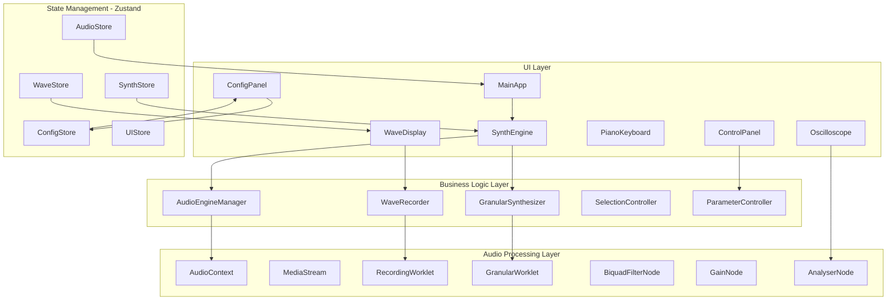
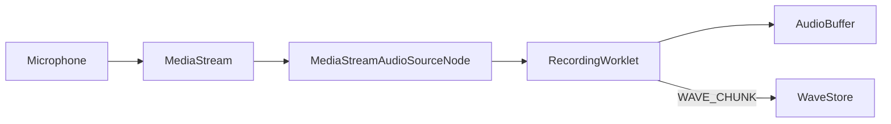
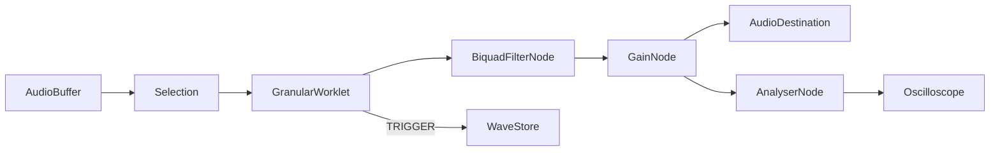
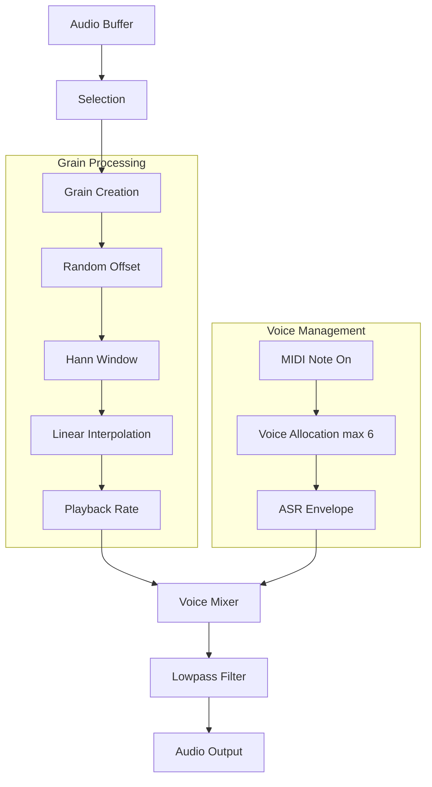
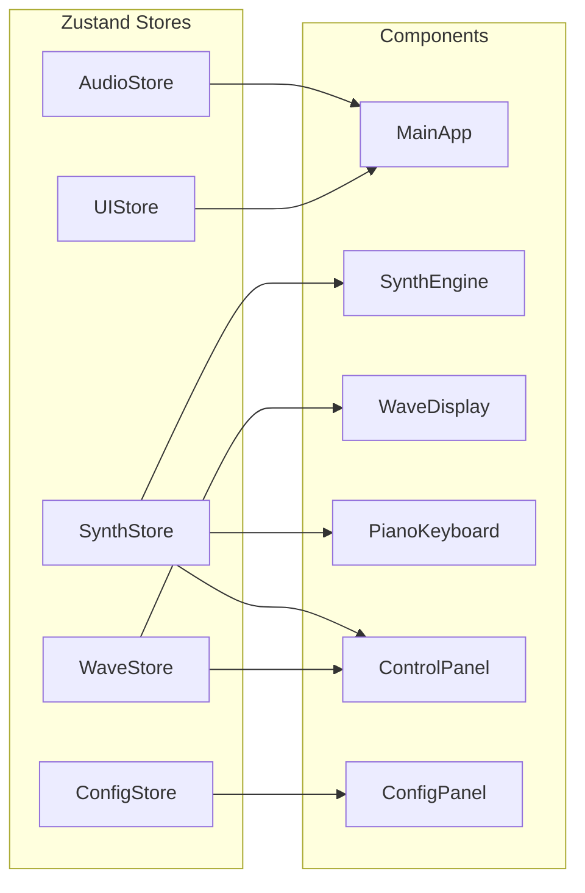
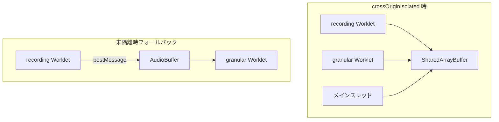

# Collidoscope Web版 設計書

ドキュメント索引: [README.md](README.md)

本ドキュメントは、Open Collidoscope の Web 再実装における**アーキテクチャと設計方針**を定義します。

- 機能要件・設定値: [web-spec.md](web-spec.md)

**注意**: 本書の TypeScript コード例は設計思想の伝達用です。実装時はライブラリ API・型・エラーハンドリングを実態に合わせて再設計してください。

## 全体アーキテクチャ



## C++ → Web 移植マッピング

| C++ モジュール | Web 対応 | 備考 |
| --- | --- | --- |
| `PGranular.h` | `features/synth-engine/worklets/granular-processor.ts` | Vite `?worker&url` でビルド |
| `EnvASR.h` | `src/domain/audio/env-asr.ts` | Worklet から import 可（純粋関数のみ） |
| `PGranularNode` | `GranularSynthesizer` クラス | Worklet との MessagePort 統合、ボイス管理 |
| `BufferToWaveRecorderNode` | `features/synth-engine/worklets/recording-processor.ts` | 録音 + チャンク min/max |
| `AudioEngine` | `AudioEngineManager` | グラフ構築、パラメータ橋渡し |
| `Wave` / `Chunk` | `features/synth-engine/components/WaveDisplay.tsx` | Canvas 描画 |
| `Oscilloscope` | `Oscilloscope` コンポーネント | `AnalyserNode` + Canvas |
| `ParticleController` | `ParticleSystem`（Canvas） | WaveDisplay 内または独立 |
| `Config` | `src/domain/config/` | Zod スキーマ + `ConfigManager` |
| `MIDI` | Web MIDI API ラッパー | `src/domain/midi/` |
| `CollidoscopeApp` | `MainApp` + Zustand stores | フレームループ → React ライフサイクル |
| `Messages` / `RingBufferPack` | `AudioWorkletNode.port` | MessagePort による双方向通信 |
| Cinder OpenGL 描画 | HTML5 Canvas | `requestAnimationFrame` |

## 音声処理パイプライン

### 録音パイプライン



```text
Microphone → MediaStreamAudioSourceNode → AudioWorkletNode(recording)
                                              ↓
                                       ChunkProcessor → WaveStore
```

録音 Worklet はオーディオスレッドでサンプルを蓄積し、チャンク境界ごとに min/max をメインスレッドへ `postMessage` します。

### 再生パイプライン



```text
AudioBuffer → GranularWorklet → BiquadFilterNode → GainNode → AudioDestination
                     ↓                                      ↓
              CursorTriggers                         AnalyserNode → Oscilloscope
```

### グラニュラー処理フロー



## 状態管理設計

Zustand で責務を分離します。Phase 2 ではエンジンごとに Store を複製するか、`engineId` キーでネストします。



### AudioStore

```typescript
interface AudioState {
  audioContext: AudioContext | null;
  sampleRate: number;
  isRecording: boolean;
  recordedBuffer: AudioBuffer | null;
  micStream: MediaStream | null;
  analyserNode: AnalyserNode | null;

  initializeAudio: () => Promise<void>;
  startRecording: () => void;
  stopRecording: () => void;
}
```

**導入タイミング**: M1。

### ConfigStore

```typescript
interface ConfigState {
  config: CollidoscopeConfig;
  configManager: ConfigManager;

  updateConfig: (updates: PartialCollidoscopeConfig) => void;
  resetConfig: () => void;
  exportConfig: () => string;   // M4
  importConfig: (json: string) => void;  // M4

  presets: Record<string, CollidoscopeConfig>;  // M4
  savePreset: (name: string) => void;  // M4
  loadPreset: (name: string) => void;  // M4
  deletePreset: (name: string) => void;  // M4
}
```

実装済みドメイン: `src/domain/config/`（Zod スキーマ、`ConfigManager`、localStorage 永続化）

### UIStore

```typescript
interface UIState {
  isConfigPanelOpen: boolean;  // false = 最小化（デフォルト）
  keyboardLayout: KeyMap;
  selectedEngine: number;
  isFullscreen: boolean;

  openConfigPanel: () => void;
  closeConfigPanel: () => void;
  toggleConfigPanel: () => void;
}
```

パネルの開閉は `UIStore`、設定値は `ConfigStore`。**導入タイミング**: M1。

### WaveStore

```typescript
interface WaveState {
  chunks: ChunkData[];
  selection: { start: number; size: number; isNull: boolean };
  cursors: Map<number, CursorData>;

  setChunk: (index: number, min: number, max: number) => void;
  setSelection: (start: number, size: number) => void;
  setCursor: (id: number, position: number) => void;
}
```

**導入タイミング**: M1（チャンク表示）。選択・カーソルは M2〜M3 で活用。

### SynthStore

```typescript
interface SynthState {
  grainDurationCoeff: number;
  filter: { cutoff: number };
  loop: { enabled: boolean };

  noteOn: (midiNote: number) => void;
  noteOff: (midiNote: number) => void;
  setLoopEnabled: (enabled: boolean) => void;
  setGrainDurationCoeff: (coeff: number) => void;
  setFilterCutoff: (cutoff: number) => void;
}
```

**導入タイミング**: M2（M1 では未使用）。

## コンポーネント設計

### MainApp

- 音声コンテキスト初期化（ユーザージェスチャー後）
- キーボードショートカット
- レイアウト管理、エラーハンドリング

### SynthEngine

```typescript
interface SynthEngineProps {
  engineId: number;
  color: string;
  position: "primary" | "secondary";
}
```

Phase 1 では `engineId=0` のみ。子コンポーネント（WaveDisplay, ControlPanel, PianoKeyboard）を統合。

**演奏面の配置（M2.5 original 完了）**: `PlayerControlSurface` が `original-layout.ts`（180 度投影）で 12 行グリッドを駆動。配置の正本は [layout-specs/original/](layout-specs/README.md) の kebab-case ブロック名。A 側は機能配線済み、B 側は配置のみ。横スライダー（`HorizontalSlider`）、Wavejet サイズ UI なし。new 版・バリアント切替は後続。

### WaveDisplay

Canvas ベース。Props で `chunks`, `selection`, `cursors`, `color` を受け取り、`requestAnimationFrame` で描画。

### GranularSynthesizer

メインスレッド側のラッパー。AudioWorkletNode の生成、MessagePort 経由のパラメータ送信、フィルター/ゲインノードの接続を担当。

```typescript
class GranularSynthesizer {
  setAudioBuffer(buffer: AudioBuffer): void;
  setSelection(start: number, size: number): void;
  noteOn(midiNote: number): void;
  noteOff(midiNote: number): void;
  setLooping(enabled: boolean): void;
  setFilterCutoff(frequency: number): void;
  dispose(): void;
}
```

### ConfigPanel

**折りたたみ式の常設パネル。** デフォルト最小化、展開時に全設定を GUI 編集できる。移植・デバッグ時にオリジナル定数をいじりながら挙動を確認する用途を兼ねる。

- **配置**: 画面右端の `Drawer`（`persistent`）または FAB + 展開パネル
- **最小化時**: 歯車アイコンのみ、または細いラベルバー
- **展開時**: MUI `Tabs` でセクション分割
- **M1**: `ConfigStore` 接続 + 「音声」タブ（`waveLength`, `chunkCount` 等）
- **M2 以降**: 実装した機能に合わせてタブを追加（グラニュラー、フィルター、視覚）
- **M4**: 「プリセット」タブ（保存・読み込み・JSON 入出力）

```typescript
// 最小化状態は UIStore で管理（ConfigStore ではない）
interface UIState {
  isConfigPanelOpen: boolean;  // false = 最小化がデフォルト
  // ...
}
```

変更は `updateConfig` → `ConfigManager` → 各 Store / Worklet へ伝播する。開閉は `uiStore.toggleConfigPanel()`。

## AudioWorklet 実装方針

### Worklet は TypeScript で書く

**全部 TS で問題ない。** `public/*.js` に手書きする必要はない。

```typescript
import recordingWorkletUrl from "./worklets/recording-processor.ts?worker&url";

await audioContext.audioWorklet.addModule(recordingWorkletUrl);
```

- Vite の `?worker&url` で TS を別チャンクにトランスパイルし、URL を `addModule` に渡す
- `?url` のみは TS を変換しないため使わない
- Worklet から `src/domain/audio/` の**純粋関数**（Hann 窓、補間、ピッチ比など）を import し、オリジナル `PGranular.h` と同じ式を共有する
- Worklet 内では React / Zustand / DOM API を import しない

アルゴリズムの正本は `domain/audio`、リアルタイム処理の殻は `worklets/*.ts`、という分担にする。

### ファイル配置

```text
src/features/synth-engine/
├── SynthEngine.tsx
├── components/
│   ├── WaveDisplay.tsx
│   ├── ControlPanel.tsx
│   ├── PianoKeyboard.tsx
│   └── Oscilloscope.tsx
├── worklets/
│   ├── recording-processor.ts
│   └── granular-processor.ts
├── hooks/
└── index.ts
```

### 録音バッファ共有（パフォーマンス優先）



| 方式 | 用途 |
| --- | --- |
| `SharedArrayBuffer` | 本番・隔離済み環境。録音と再生が同一メモリを参照 |
| `postMessage` + コピー | `crossOriginIsolated` が false のとき（開発初回、coi 未導入） |

**GitHub Pages**: カスタム HTTP ヘッダが使えないため、[coi-serviceworker](https://github.com/gzuidhof/coi-serviceworker) で Service Worker 経由の COOP/COEP 注入を行う（スパイクで検証済み。`vite.config.ts` のプラグインが `dist/` に同梱）。初回訪問時にページリロードが発生する点に留意。

### recording-processor.ts

- 入力サンプルをバッファに蓄積（SAB または内部バッファ）
- チャンク境界で min/max を計算し `postMessage`
- 録音完了をメインスレッドへ通知

### granular-processor.ts

オリジナル `PGranular` の `processGrains` / `synthesizeGrain` を移植:

- グレインプール（最大 32、再利用）
- raised cosine bell エンベロープ
- 線形補間
- `port.onmessage` でパラメータ受信
- トリガー時に `postMessage({ type: 'cursorTrigger', ... })`

### メインスレッド ↔ Worklet 通信

| 方向 | メッセージ例 |
| --- | --- |
| Main → Worklet | `setAudioBuffer`, `setSelection`, `noteOn`, `noteOff`, `setLooping`, `setGrainDurationCoeff` |
| Worklet → Main | `recordingComplete`, `waveChunk`, `cursorTrigger`, `grainEnd` |

## オリジナルとの意図的な差異

| 観点 | オリジナル | Web 版 |
| --- | --- | --- |
| 定数 | `Config.h` でハードコード | Zod スキーマ + 設定 UI で変更可能 |
| 入力 | Teensy 物理コントローラー + MIDI | PC キーボード + Web MIDI + 画面上 UI |
| 描画 | Cinder OpenGL | HTML5 Canvas |
| スレッド | Cinder オーディオスレッド + GUI スレッド | AudioWorklet + メインスレッド（React） |
| レイアウト | 縦 2 分割固定 | Phase 1 は単一、レスポンシブ対応 |
| 設定永続化 | XML（未使用） | localStorage + JSON 入出力 |
| 波形数 | 常に 2 | Phase 1 は 1、Phase 2 で 2 |

## 設定の動的変更

`ConfigStore` の変更を各 Store / AudioWorklet に伝播します。

```typescript
// 設定変更時の反映例
useEffect(() => {
  if (config.audio.chunkCount !== currentChunkCount) {
    waveStore.updateChunks(config.audio.chunkCount);
  }
  granularSynth.updateParams({
    maxGrains: config.granular.maxGrains,
    minGrainDuration: config.granular.minGrainDuration,
  });
}, [config]);
```

チャンク数変更時は選択範囲の再計算、色設定は CSS カスタムプロパティへ即時反映。

## パフォーマンス最適化

| 領域 | 方針 |
| --- | --- |
| 音声 | AudioWorklet でメインスレッド非ブロッキング。グレインプール再利用 |
| React | `useMemo`, `useCallback`, `React.memo` で再描画抑制 |
| Canvas | `requestAnimationFrame`、必要領域のみ再描画 |
| メモリ | AudioBuffer の適切な解放、Worklet 内プール管理 |

## エラーハンドリング

| エラー種別 | 対応 |
| --- | --- |
| マイク権限拒否 | `AudioPermissionError`、UI で再試行案内 |
| AudioWorklet 非対応 | ブラウザ要件を表示 |
| 非セキュアコンテキスト | HTTPS 必須の案内 |
| Worklet 読み込み失敗 | `AudioWorkletError`、フォールバックなし（必須機能） |
| 設定 JSON 不正 | Zod 検証エラーをユーザーに表示 |

起動時に `checkSecureContext()` と `checkAudioWorkletSupport()` を実行。

## テスト戦略

| レイヤー | 対象 | 環境 |
| --- | --- | --- |
| 単体 | 設定ドメイン、ユーティリティ、エンベロープ計算 | Vitest（node / jsdom） |
| コンポーネント | UI コンポーネント | Vitest + Testing Library |
| 統合 | Store ↔ ドメインロジック | Vitest |
| E2E | 録音・演奏フロー | Playwright（将来） |

音声 Worklet はブラウザ依存のため、核心アルゴリズム（Hann 窓、補間、ピッチ計算）は純粋関数として `src/domain/audio/` に切り出し、node 環境でテスト可能にする。

## ディレクトリ構成

[coding-rules.mdc](.cursor/rules/coding-rules.mdc) に準拠。機能単位は `features/` にコロケーションする。

```text
src/
├── features/
│   └── synth-engine/           # Phase 1 の主機能
│       ├── SynthEngine.tsx     # メインコンポーネント
│       ├── components/         # WaveDisplay, ControlPanel 等
│       ├── worklets/           # recording / granular（TypeScript）
│       ├── hooks/              # useRecording, useGranular 等
│       └── index.ts            # SynthEngine のみ re-export
├── components/                 # 汎用 UI（Button, Layout 等）
├── domain/
│   ├── config/                 # 実装済み
│   ├── audio/                  # 純粋関数（Worklet とテストで共有）
│   └── midi/                   # Web MIDI ラッパー（M4）
├── stores/                     # グローバル Zustand（Audio, Wave, Synth, Config, UI）
├── hooks/                      # アプリ全体のフック
├── test/                       # setup, test-utils
├── App.tsx
└── main.tsx
```

**Store の配置**: Phase 1 は単一エンジンのため `src/stores/` に集約。Phase 2 で `engineId` キーを増やすか、エンジンごとにインスタンス化する。

**設定 UI**: `ConfigPanel` は **M1 から** `features/synth-engine/components/` に常設（折りたたみ式）。`ConfigStore` と同時に導入し、マイルストーンごとにタブを増やす。プリセット・JSON は M4。

## 今後の拡張

1. **Phase 2**: `SynthEngine` の複製、Store の `engineId` 分離、縦分割レイアウト
2. **Web MIDI**: CC マッピングの学習機能
3. **エフェクト**: リバーブ、ディストーション、ディレイ（オリジナル外）
4. **PWA**: オフライン対応
