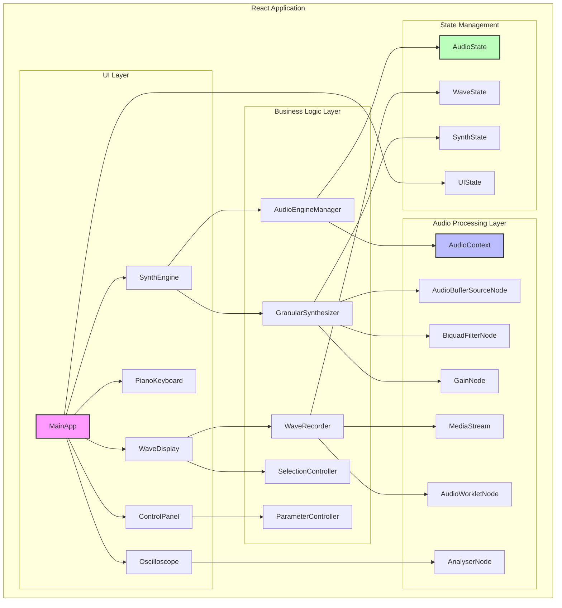
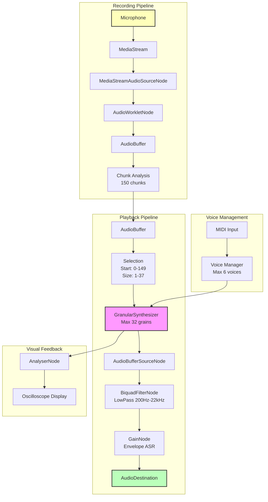
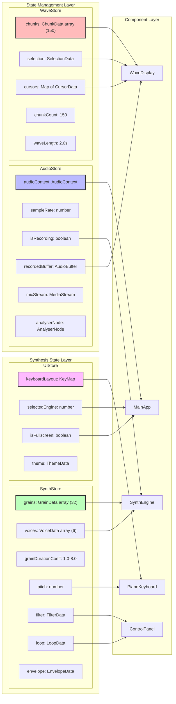
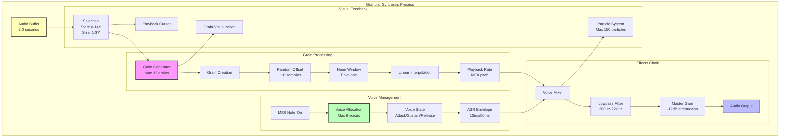
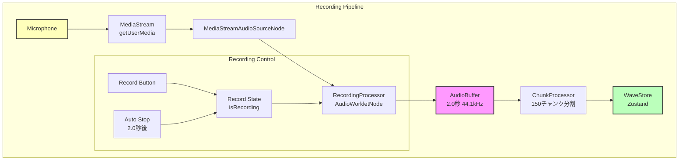
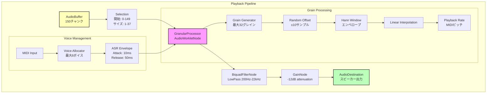
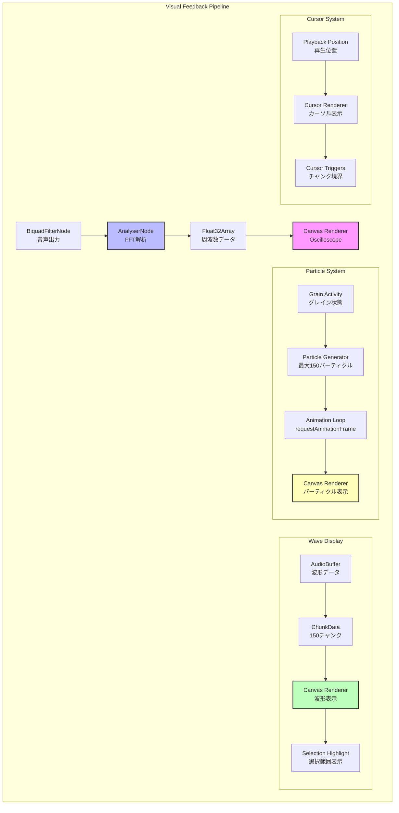
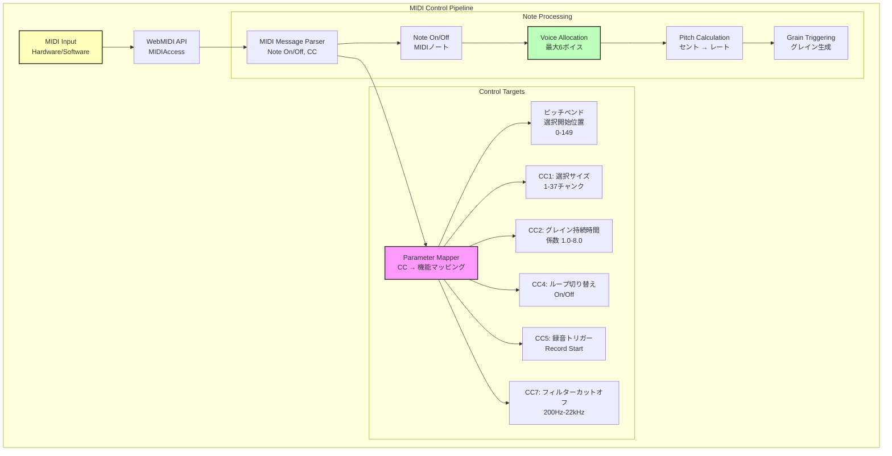

# Collidoscope Web版 設計書

## ⚠️ 重要な注意事項

**コード例について**：本設計書に記載されているTypeScriptコードは、アーキテクチャ設計の概念と実装方向性を示すための**擬似コード的な説明**です。実際の実装時には以下の点を考慮して再設計してください：

- **依存関係の詳細確認**：ライブラリのバージョンやAPIの最新仕様
- **型定義の精密化**：実際の使用場面での型安全性の詳細検証  
- **エラーハンドリングの拡張**：プロダクション環境での包括的なエラー処理
- **パフォーマンス最適化**：実際の使用パターンでの性能測定と最適化
- **テスタビリティ**：単体テスト・統合テストに適した構造への調整
- **ブラウザ互換性**：対象ブラウザでの実際の動作確認

設計書のコードは**設計思想の伝達**が目的であり、そのままコピー＆ペーストして使用することは推奨されません。

## 概要

本設計書は、オリジナルのCollidoscope（C++/Cinder）をWeb技術（React + TypeScript + Web Audio API）で再実装するためのアーキテクチャと設計を定義します。

## 全体アーキテクチャ



## 技術スタック

### フロントエンド

- **React 18**: UIコンポーネント
- **TypeScript**: 型安全性
- **Vite**: 開発・ビルドツール
- **MUI v7**: UIコンポーネントライブラリ

### 状態管理

- **Zustand**: 軽量で型安全な状態管理

### 音声処理

- **Web Audio API**: リアルタイム音声処理
- **Canvas API**: 波形・オシロスコープ・パーティクル描画

## 音声処理パイプライン



## 状態管理設計



### 1. AudioStore (Zustand)

```typescript
interface AudioState {
  // 音声コンテキスト
  audioContext: AudioContext | null;
  sampleRate: number;
  
  // 録音状態
  isRecording: boolean;
  recordingTime: number;
  recordedBuffer: AudioBuffer | null;
  
  // 音声ノード
  micStream: MediaStream | null;
  inputNode: MediaStreamAudioSourceNode | null;
  analyserNode: AnalyserNode | null;
  
  // アクション
  initializeAudio: () => Promise<void>;
  startRecording: () => void;
  stopRecording: () => void;
  setRecordedBuffer: (buffer: AudioBuffer) => void;
}
```

### 2. ConfigStore (Zustand)

```typescript
interface ConfigState {
  // 設定管理
  config: CollidoscopeConfig;
  configManager: ConfigManager;
  
  // 設定状態
  isConfigOpen: boolean;
  selectedPreset: string | null;
  presets: Record<string, CollidoscopeConfig>;
  
  // アクション
  updateConfig: (updates: Partial<CollidoscopeConfig>) => void;
  resetConfig: () => void;
  exportConfig: () => string;
  importConfig: (configJson: string) => void;
  
  // プリセット管理
  savePreset: (name: string) => void;
  loadPreset: (name: string) => void;
  deletePreset: (name: string) => void;
  
  // UI制御
  openConfigPanel: () => void;
  closeConfigPanel: () => void;
}
```

### 3. WaveStore (Zustand)

```typescript
interface WaveState {
  // 波形データ
  chunks: ChunkData[];
  chunkCount: number;
  waveLength: number;
  
  // 選択範囲
  selection: {
    start: number;
    size: number;
    isNull: boolean;
  };
  
  // カーソル
  cursors: Map<number, CursorData>;
  
  // アクション
  setChunk: (index: number, min: number, max: number) => void;
  setSelection: (start: number, size: number) => void;
  setCursor: (id: number, position: number) => void;
  removeCursor: (id: number) => void;
  resetWave: () => void;
}
```

### 4. SynthStore (Zustand)

```typescript
interface SynthState {
  // グラニュラーシンセシス
  grains: GrainData[];
  maxGrains: number;
  grainDurationCoeff: number;
  
  // ボイス管理
  voices: VoiceData[];
  maxVoices: number;
  
  // パラメータ
  pitch: number;
  filter: {
    cutoff: number;
    enabled: boolean;
  };
  loop: {
    enabled: boolean;
    rate: number;
  };
  
  // エンベロープ
  envelope: {
    attack: number;
    release: number;
    state: 'idle' | 'attack' | 'sustain' | 'release';
  };
  
  // アクション
  noteOn: (midiNote: number) => void;
  noteOff: (midiNote: number) => void;
  setLoopEnabled: (enabled: boolean) => void;
  setGrainDurationCoeff: (coeff: number) => void;
  setFilterCutoff: (cutoff: number) => void;
}
```

## コンポーネント設計

### 1. MainApp (最上位コンポーネント)

```typescript
interface MainAppProps {}

const MainApp: React.FC<MainAppProps> = () => {
  // 音声初期化
  // キーボードイベント処理
  // レイアウト管理
  // エラーハンドリング
};
```

### 2. SynthEngine (シンセエンジンコンテナ)

```typescript
interface SynthEngineProps {
  engineId: number;
  color: string;
  position: 'primary' | 'secondary';
}

const SynthEngine: React.FC<SynthEngineProps> = ({ engineId, color, position }) => {
  // 音声エンジンの管理
  // 子コンポーネントの統合
  // エンジン固有の状態管理
};
```

### 3. WaveDisplay (波形表示)

```typescript
interface WaveDisplayProps {
  engineId: number;
  width: number;
  height: number;
  color: string;
  chunks: ChunkData[];
  selection: SelectionData;
  cursors: CursorData[];
}

const WaveDisplay: React.FC<WaveDisplayProps> = (props) => {
  const canvasRef = useRef<HTMLCanvasElement>(null);
  
  // Canvas描画ロジック
  // アニメーション管理
  // ユーザーインタラクション
};
```

### 4. GranularSynthesizer (グラニュラーシンセシス)

```typescript
interface GranularSynthesizerProps {
  audioContext: AudioContext;
  audioBuffer: AudioBuffer;
  selection: SelectionData;
  parameters: SynthParameters;
  onGrainTrigger: (grainId: number) => void;
}

class GranularSynthesizer {
  private grains: Grain[] = [];
  private envelope: ASREnvelope;
  private randomOffset: RandomGenerator;
  
  // グレイン管理
  // エンベロープ処理
  // 音声合成
}
```

### 5. ControlPanel (コントロールパネル)

```typescript
interface ControlPanelProps {
  engineId: number;
  onParameterChange: (param: string, value: number) => void;
}

const ControlPanel: React.FC<ControlPanelProps> = ({ engineId, onParameterChange }) => {
  // スライダー・ノブ
  // ボタン
  // パラメータバインディング
};
```

### 6. ConfigPanel (設定パネル)

```typescript
interface ConfigPanelProps {
  isOpen: boolean;
  onClose: () => void;
}

const ConfigPanel: React.FC<ConfigPanelProps> = ({ isOpen, onClose }) => {
  const { config, updateConfig, presets, savePreset, loadPreset } = useConfigStore();
  
  // 設定項目の表示
  // リアルタイム設定変更
  // プリセット管理
  // インポート/エクスポート機能
  
  return (
    <Dialog open={isOpen} onClose={onClose} maxWidth="lg" fullWidth>
      <DialogTitle>
        Collidoscope 設定
        <IconButton onClick={onClose} sx={{ position: 'absolute', right: 8, top: 8 }}>
          <CloseIcon />
        </IconButton>
      </DialogTitle>
      
      <DialogContent>
        <Tabs>
          <TabPanel label="音声設定">
            <AudioConfigSection />
          </TabPanel>
          <TabPanel label="グラニュラーシンセシス">
            <GranularConfigSection />
          </TabPanel>
          <TabPanel label="視覚設定">
            <VisualConfigSection />
          </TabPanel>
          <TabPanel label="MIDI設定">
            <MidiConfigSection />
          </TabPanel>
          <TabPanel label="プリセット">
            <PresetConfigSection />
          </TabPanel>
        </Tabs>
      </DialogContent>
    </Dialog>
  );
};
```

## グラニュラーシンセシス処理フロー



### 音声処理パイプライン詳細

#### 1. 録音パイプライン



#### 2. 再生パイプライン



#### 3. 視覚化・フィードバックパイプライン



#### 4. MIDI制御パイプライン



## 重要なクラス・インターフェース

### 1. Grain (グレイン)

```typescript
interface Grain {
  id: number;
  phase: number;        // 読み取り位置
  rate: number;         // 再生レート
  alive: boolean;       // 生存状態
  age: number;          // 年齢（サンプル数）
  duration: number;     // 持続時間
  
  // Hann窓エンベロープ用
  b1: number;
  y1: number;
  y2: number;
}
```

### 2. ChunkData (チャンク)

```typescript
interface ChunkData {
  index: number;
  min: number;          // 最小振幅
  max: number;          // 最大振幅
  animate: number;      // アニメーション進行度 (0-1)
  resetting: boolean;   // リセット中フラグ
}
```

### 3. SelectionData (選択範囲)

```typescript
interface SelectionData {
  start: number;        // 開始チャンク
  size: number;         // サイズ（チャンク数）
  isNull: boolean;      // 非選択状態
  color: string;        // 表示色
  particleSpread: number; // パーティクル範囲
}
```

### 4. VoiceData (ボイス)

```typescript
interface VoiceData {
  id: number;
  midiNote: number;
  rate: number;         // 周波数比
  grains: Grain[];
  envelope: ASREnvelope;
  active: boolean;
}
```

## 定数管理

### Config.ts (設定可能な値)

```typescript
// 設定可能な値（ユーザーが変更可能）
export interface CollidoscopeConfig {
  // 音声設定
  audio: {
    sampleRate: number;           // サンプルレート（通常44100）
    chunkCount: number;           // チャンク数（デフォルト150）
    waveLength: number;           // 録音時間（デフォルト2.0秒）
    maxSelectionSize: number;     // 最大選択サイズ（デフォルト37）
    attenuation: number;          // アテニュエーション（デフォルト-12dB）
  };
  
  // グラニュラーシンセシス設定
  granular: {
    maxGrains: number;            // 最大グレイン数（デフォルト32）
    maxVoices: number;            // 最大ボイス数（デフォルト6）
    minGrainDuration: number;     // 最小グレイン持続時間（デフォルト640サンプル）
    grainDurationRange: {        // グレイン持続係数範囲
      min: number;                // デフォルト1.0
      max: number;                // デフォルト8.0
    };
  };
  
  // エンベロープ設定
  envelope: {
    attackTime: number;           // アタック時間（デフォルト10ms）
    releaseTime: number;          // リリース時間（デフォルト50ms）
    sustainLevel: number;         // サステインレベル（デフォルト1.0）
  };
  
  // フィルター設定
  filter: {
    minCutoff: number;            // 最小カットオフ周波数（デフォルト200Hz）
    maxCutoff: number;            // 最大カットオフ周波数（デフォルト22050Hz）
    qFactor: number;              // Qファクター（デフォルト0.707）
  };
  
  // 視覚設定
  visual: {
    colors: {
      wave1: string;              // Wave1色（デフォルト#F3063E）
      wave2: string;              // Wave2色（デフォルト#FFCC00）
      cursor: string;             // カーソル色（デフォルト#FFFFFF）
    };
    maxParticles: number;         // 最大パーティクル数（デフォルト150）
    chunkAnimationFrames: number; // チャンクアニメーションフレーム数（デフォルト3）
  };
  
  // MIDI設定
  midi: {
    pitchBendRange: {            // ピッチベンド範囲
      min: number;                // デフォルト0
      max: number;                // デフォルト149
    };
    ccMappings: {                // CC制御マッピング
      selectionSize: number;      // 選択サイズ（デフォルトCC1）
      grainDuration: number;      // グレイン持続時間（デフォルトCC2）
      loopToggle: number;         // ループ切り替え（デフォルトCC4）
      recordTrigger: number;      // 録音トリガー（デフォルトCC5）
      filterCutoff: number;       // フィルターカットオフ（デフォルトCC7）
    };
  };
}

// デフォルト設定
// Zodスキーマ定義
import { z } from 'zod';

const CollidoscopeConfigSchema = z.object({
  audio: z.object({
    sampleRate: z.number().positive().default(44100),
    chunkCount: z.number().int().min(1).max(1000).default(150),
    waveLength: z.number().positive().min(0.1).max(10).default(2.0),
    maxSelectionSize: z.number().int().min(1).max(37).default(37),
    attenuation: z.number().min(0).max(1).default(0.25118864315096),
  }),
  granular: z.object({
    maxGrains: z.number().int().min(1).max(128).default(32),
    maxVoices: z.number().int().min(1).max(16).default(6),
    minGrainDuration: z.number().positive().default(640),
    grainDurationRange: z.object({
      min: z.number().positive().min(1).max(8).default(1.0),
      max: z.number().positive().min(1).max(8).default(8.0),
    }),
  }),
  envelope: z.object({
    attackTime: z.number().positive().min(0.001).max(1).default(0.01),
    releaseTime: z.number().positive().min(0.001).max(1).default(0.05),
    sustainLevel: z.number().min(0).max(1).default(1.0),
  }),
  filter: z.object({
    minCutoff: z.number().positive().min(20).max(20000).default(200),
    maxCutoff: z.number().positive().min(200).max(22050).default(22050),
    qFactor: z.number().positive().min(0.1).max(30).default(0.707),
  }),
  visual: z.object({
    colors: z.object({
      wave1: z.string().regex(/^#[0-9A-F]{6}$/i).default('#F3063E'),
      wave2: z.string().regex(/^#[0-9A-F]{6}$/i).default('#FFCC00'),
      cursor: z.string().regex(/^#[0-9A-F]{6}$/i).default('#FFFFFF'),
    }),
    maxParticles: z.number().int().min(10).max(1000).default(150),
    chunkAnimationFrames: z.number().int().min(1).max(10).default(3),
  }),
  midi: z.object({
    pitchBendRange: z.object({
      min: z.number().int().min(0).max(149).default(0),
      max: z.number().int().min(0).max(149).default(149),
    }),
    ccMappings: z.object({
      selectionSize: z.number().int().min(0).max(127).default(1),
      grainDuration: z.number().int().min(0).max(127).default(2),
      loopToggle: z.number().int().min(0).max(127).default(4),
      recordTrigger: z.number().int().min(0).max(127).default(5),
      filterCutoff: z.number().int().min(0).max(127).default(7),
    }),
  }),
});

// Partial版スキーマ（設定更新用）
const PartialCollidoscopeConfigSchema = CollidoscopeConfigSchema.deepPartial();

// 型の生成
type CollidoscopeConfig = z.infer<typeof CollidoscopeConfigSchema>;

// デフォルト設定
export const DEFAULT_CONFIG: CollidoscopeConfig = {
  audio: {
    sampleRate: 44100,
    chunkCount: 150,
    waveLength: 2.0,
    maxSelectionSize: 37,
    attenuation: 0.25118864315096, // -12dB
  },
  granular: {
    maxGrains: 32,
    maxVoices: 6,
    minGrainDuration: 640,
    grainDurationRange: {
      min: 1.0,
      max: 8.0,
    },
  },
  envelope: {
    attackTime: 0.01,   // 10ms
    releaseTime: 0.05,  // 50ms
    sustainLevel: 1.0,
  },
  filter: {
    minCutoff: 200,
    maxCutoff: 22050,
    qFactor: 0.707,
  },
  visual: {
    colors: {
      wave1: '#F3063E',
      wave2: '#FFCC00',
      cursor: '#FFFFFF',
    },
    maxParticles: 150,
    chunkAnimationFrames: 3,
  },
  midi: {
    pitchBendRange: {
      min: 0,
      max: 149,
    },
    ccMappings: {
      selectionSize: 1,
      grainDuration: 2,
      loopToggle: 4,
      recordTrigger: 5,
      filterCutoff: 7,
    },
  },
};

// 設定管理クラス
export class ConfigManager {
  private config: CollidoscopeConfig;
  
  constructor(initialConfig: Partial<CollidoscopeConfig> = {}) {
    this.config = this.mergeConfig(DEFAULT_CONFIG, initialConfig);
    this.loadFromStorage();
  }
  
  // 型安全なlocalStorageからの読み込み
  private loadFromStorage(): void {
    const stored = localStorage.getItem('collidoscope-config');
    
    if (!stored) {
      return;
    }
    
    try {
      const parsed = JSON.parse(stored);
      
      // Zodスキーマで検証
      const result = PartialCollidoscopeConfigSchema.safeParse(parsed);
      
      if (result.success) {
        this.config = this.mergeConfig(this.config, result.data);
      } else {
        console.warn('保存されている設定の形式が無効です。デフォルト設定を使用します。', result.error.errors);
      }
    } catch (error) {
      console.warn('設定の読み込みに失敗しました。デフォルト設定を使用します。', error);
    }
  }
  
  // 型安全なlocalStorageへの保存
  private saveToStorage(): void {
    try {
      // 保存前に設定を検証
      const validatedConfig = CollidoscopeConfigSchema.parse(this.config);
      localStorage.setItem('collidoscope-config', JSON.stringify(validatedConfig, null, 2));
    } catch (error) {
      console.error('設定の保存に失敗しました:', error);
    }
  }
  
  // 設定値の取得
  getConfig(): CollidoscopeConfig {
    return { ...this.config };
  }
  
  // 設定値の更新
  updateConfig(updates: Partial<CollidoscopeConfig>): void {
    this.config = this.mergeConfig(this.config, updates);
    this.validateConfig();
    this.saveToStorage(); // 型安全な自動保存
  }
  
  // 設定値のリセット
  resetConfig(): void {
    this.config = { ...DEFAULT_CONFIG };
    this.saveToStorage(); // リセット後に設定を保存
  }
  
  // 設定値の検証
  private validateConfig(): void {
    // 範囲チェック
    if (this.config.audio.chunkCount < 1 || this.config.audio.chunkCount > 1000) {
      throw new Error('チャンク数は1-1000の範囲で設定してください');
    }
    
    if (this.config.audio.waveLength < 0.1 || this.config.audio.waveLength > 10) {
      throw new Error('録音時間は0.1-10秒の範囲で設定してください');
    }
    
    if (this.config.granular.maxGrains < 1 || this.config.granular.maxGrains > 128) {
      throw new Error('最大グレイン数は1-128の範囲で設定してください');
    }
    
    if (this.config.granular.maxVoices < 1 || this.config.granular.maxVoices > 16) {
      throw new Error('最大ボイス数は1-16の範囲で設定してください');
    }
    
    // 依存関係チェック
    if (this.config.audio.maxSelectionSize > this.config.audio.chunkCount) {
      throw new Error('最大選択サイズはチャンク数以下で設定してください');
    }
  }
  
  // 設定値のマージ
  private mergeConfig(base: CollidoscopeConfig, updates: Partial<CollidoscopeConfig>): CollidoscopeConfig {
    return {
      audio: { ...base.audio, ...updates.audio },
      granular: { 
        ...base.granular, 
        ...updates.granular,
        grainDurationRange: { ...base.granular.grainDurationRange, ...updates.granular?.grainDurationRange }
      },
      envelope: { ...base.envelope, ...updates.envelope },
      filter: { ...base.filter, ...updates.filter },
      visual: { 
        ...base.visual, 
        ...updates.visual,
        colors: { ...base.visual.colors, ...updates.visual?.colors }
      },
      midi: { 
        ...base.midi, 
        ...updates.midi,
        pitchBendRange: { ...base.midi.pitchBendRange, ...updates.midi?.pitchBendRange },
        ccMappings: { ...base.midi.ccMappings, ...updates.midi?.ccMappings }
      },
    };
  }
  
  // 設定のエクスポート（JSON）
  exportConfig(): string {
    return JSON.stringify(this.config, null, 2);
  }
  
  // 設定のインポート（JSON）- 型安全な実装
  importConfig(configJson: string): void {
    try {
      const imported = JSON.parse(configJson);
      
      // Zodスキーマで検証
      const result = PartialCollidoscopeConfigSchema.safeParse(imported);
      
      if (result.success) {
        this.updateConfig(result.data);
      } else {
        const errorMessage = result.error.errors
          .map(err => `${err.path.join('.')}: ${err.message}`)
          .join(', ');
        throw new Error(`設定ファイルの形式が無効です: ${errorMessage}`);
      }
    } catch (error) {
      if (error instanceof SyntaxError) {
        throw new Error('JSONの構文が無効です');
      }
      throw error;
    }
  }
}
```

### 使用例

```typescript
// アプリケーション初期化時
const configManager = new ConfigManager();

// カスタム設定の適用
configManager.updateConfig({
  audio: {
    chunkCount: 200,    // チャンク数を200に変更
    waveLength: 3.0,    // 録音時間を3秒に変更
  },
  granular: {
    maxGrains: 64,      // 最大グレイン数を64に変更
  },
  visual: {
    colors: {
      wave1: '#FF0000', // Wave1の色を赤に変更
    },
  },
});

// 設定値の取得
const config = configManager.getConfig();
const chunkCount = config.audio.chunkCount;
```

## AudioWorklet実装詳細

### 1. AudioWorkletProcessor（音声処理ワーカー）

```javascript
// granular-processor.js
class GranularProcessor extends AudioWorkletProcessor {
  constructor() {
    super();
    this.grains = new Array(32).fill(null).map(() => new Grain());
    this.audioBuffer = null;
    this.selectionStart = 0;
    this.selectionSize = 1;
    this.isLooping = false;
    
    // メインスレッドからのメッセージを処理
    this.port.onmessage = (event) => {
      this.handleMessage(event.data);
    };
  }
  
  process(inputs, outputs, parameters) {
    const output = outputs[0];
    const frameCount = output[0].length;
    
    if (!this.audioBuffer) {
      return true;
    }
    
    // グレインの生成と処理
    for (let grain of this.grains) {
      if (grain.alive) {
        this.processGrain(grain, output, frameCount);
      }
    }
    
    return true;
  }
  
  processGrain(grain, output, frameCount) {
    const bufferData = this.audioBuffer.getChannelData(0);
    const selectionStartSample = this.selectionStart * (bufferData.length / 150);
    const selectionEndSample = (this.selectionStart + this.selectionSize) * (bufferData.length / 150);
    
    for (let i = 0; i < frameCount; i++) {
      if (grain.age >= grain.duration) {
        grain.alive = false;
        break;
      }
      
      // 線形補間サンプリング
      const position = selectionStartSample + (grain.phase * grain.rate);
      const sampleIndex = Math.floor(position);
      const fraction = position - sampleIndex;
      
      if (sampleIndex < selectionEndSample - 1) {
        const sample1 = bufferData[sampleIndex];
        const sample2 = bufferData[sampleIndex + 1];
        const interpolatedSample = sample1 + fraction * (sample2 - sample1);
        
        // Hann窓エンベロープ適用
        const envelope = this.calculateHannEnvelope(grain.age, grain.duration);
        const finalSample = interpolatedSample * envelope;
        
        // 出力に加算
        output[0][i] += finalSample;
        output[1][i] += finalSample; // ステレオ
      }
      
      grain.phase++;
      grain.age++;
      
      // ループ処理
      if (this.isLooping && grain.phase >= (selectionEndSample - selectionStartSample)) {
        grain.phase = 0;
      }
    }
  }
  
  calculateHannEnvelope(age, duration) {
    const t = age / duration;
    return 0.5 * (1 - Math.cos(2 * Math.PI * t));
  }
  
  handleMessage(data) {
    switch (data.type) {
      case 'setAudioBuffer':
        this.audioBuffer = data.buffer;
        break;
      case 'setSelection':
        this.selectionStart = data.start;
        this.selectionSize = data.size;
        break;
      case 'noteOn':
        this.triggerGrain(data.midiNote);
        break;
      case 'setLooping':
        this.isLooping = data.enabled;
        break;
    }
  }
  
  triggerGrain(midiNote) {
    const availableGrain = this.grains.find(g => !g.alive);
    if (availableGrain) {
      availableGrain.alive = true;
      availableGrain.age = 0;
      availableGrain.phase = Math.random() * 10; // ランダムオフセット
      availableGrain.rate = Math.pow(2, (midiNote - 60) / 12);
      availableGrain.duration = 640 * this.grainDurationCoeff;
    }
  }
}

// グレインクラス
class Grain {
  constructor() {
    this.alive = false;
    this.age = 0;
    this.phase = 0;
    this.rate = 1.0;
    this.duration = 640;
  }
}

registerProcessor('granular-processor', GranularProcessor);
```

### 2. AudioWorkletNode統合

```typescript
// AudioWorkletNodeの初期化と使用
class GranularSynthesizer {
  private audioContext: AudioContext;
  private workletNode: AudioWorkletNode;
  private gainNode: GainNode;
  private filterNode: BiquadFilterNode;
  
  constructor(audioContext: AudioContext) {
    this.audioContext = audioContext;
    this.initializeAudioWorklet();
  }
  
  private async initializeAudioWorklet() {
    try {
      // AudioWorkletモジュールを読み込み
      await this.audioContext.audioWorklet.addModule('/audio-worklets/granular-processor.js');
      
      // AudioWorkletNodeを作成
      this.workletNode = new AudioWorkletNode(this.audioContext, 'granular-processor');
      
      // エフェクトチェーンの構築
      this.filterNode = this.audioContext.createBiquadFilter();
      this.filterNode.type = 'lowpass';
      this.filterNode.frequency.value = 22050;
      
      this.gainNode = this.audioContext.createGain();
      this.gainNode.gain.value = 0.25118864315096; // -12dB attenuation
      
      // 接続
      this.workletNode.connect(this.filterNode);
      this.filterNode.connect(this.gainNode);
      this.gainNode.connect(this.audioContext.destination);
      
    } catch (error) {
      console.error('AudioWorklet initialization failed:', error);
      throw new Error('AudioWorkletの初期化に失敗しました');
    }
  }
  
  // オーディオバッファを設定
  setAudioBuffer(buffer: AudioBuffer) {
    this.workletNode.port.postMessage({
      type: 'setAudioBuffer',
      buffer: buffer
    });
  }
  
  // 選択範囲を設定
  setSelection(start: number, size: number) {
    this.workletNode.port.postMessage({
      type: 'setSelection',
      start: start,
      size: size
    });
  }
  
  // ノートオン
  noteOn(midiNote: number) {
    this.workletNode.port.postMessage({
      type: 'noteOn',
      midiNote: midiNote
    });
  }
  
  // ループ設定
  setLooping(enabled: boolean) {
    this.workletNode.port.postMessage({
      type: 'setLooping',
      enabled: enabled
    });
  }
  
  // フィルター設定
  setFilterCutoff(frequency: number) {
    this.filterNode.frequency.setValueAtTime(frequency, this.audioContext.currentTime);
  }
  
  // 音量設定
  setGain(gain: number) {
    this.gainNode.gain.setValueAtTime(gain, this.audioContext.currentTime);
  }
  
  // リソースの解放
  dispose() {
    this.workletNode.disconnect();
    this.filterNode.disconnect();
    this.gainNode.disconnect();
  }
}
```

### 3. 録音用AudioWorkletProcessor

```javascript
// recording-processor.js
class RecordingProcessor extends AudioWorkletProcessor {
  constructor() {
    super();
    this.isRecording = false;
    this.recordedSamples = [];
    this.maxSamples = 44100 * 2; // 2秒分
    
    this.port.onmessage = (event) => {
      if (event.data.type === 'startRecording') {
        this.startRecording();
      } else if (event.data.type === 'stopRecording') {
        this.stopRecording();
      }
    };
  }
  
  process(inputs, outputs, parameters) {
    const input = inputs[0];
    
    if (this.isRecording && input.length > 0) {
      const channelData = input[0];
      
      for (let i = 0; i < channelData.length; i++) {
        if (this.recordedSamples.length < this.maxSamples) {
          this.recordedSamples.push(channelData[i]);
        }
      }
      
      // 録音完了チェック
      if (this.recordedSamples.length >= this.maxSamples) {
        this.stopRecording();
      }
    }
    
    return true;
  }
  
  startRecording() {
    this.isRecording = true;
    this.recordedSamples = [];
    this.port.postMessage({ type: 'recordingStarted' });
  }
  
  stopRecording() {
    this.isRecording = false;
    this.port.postMessage({ 
      type: 'recordingComplete',
      samples: this.recordedSamples 
    });
  }
}

registerProcessor('recording-processor', RecordingProcessor);
```

## ユーティリティ関数

### 1. 音声処理ユーティリティ

```typescript
// MIDI音程計算
export function calculateMidiNoteRatio(midiNote: number): number {
  const distanceFromCenter = midiNote - 60; // 中央C基準
  return Math.pow(2, distanceFromCenter / 12);
}

// 線形補間
export function interpolateLinear(x0: number, x1: number, t: number): number {
  return (1 - t) * x0 + t * x1;
}

// Hann窓
export function createHannWindow(size: number): Float32Array {
  const window = new Float32Array(size);
  for (let i = 0; i < size; i++) {
    window[i] = 0.5 * (1 - Math.cos(2 * Math.PI * i / (size - 1)));
  }
  return window;
}

// AudioWorklet対応チェック
export function isAudioWorkletSupported(): boolean {
  return 'audioWorklet' in AudioContext.prototype;
}
```

### 2. Canvas描画ユーティリティ

```typescript
// チャンク描画
export function drawChunk(
  ctx: CanvasRenderingContext2D,
  chunk: ChunkData,
  x: number,
  centerY: number,
  maxHeight: number,
  color: string
): void {
  // チャンク描画ロジック
}

// カーソル描画
export function drawCursor(
  ctx: CanvasRenderingContext2D,
  position: number,
  color: string
): void {
  // カーソル描画ロジック
}
```

## パフォーマンス最適化

### 1. Web Audio API最適化

- **AudioWorkletNode**: ScriptProcessorNode（非推奨）の代替として使用（低レイテンシ、メインスレッド非ブロッキング）
- **AudioWorklet**: 専用の音声処理ワーカースレッドでリアルタイム処理
- **バッファプール**: AudioBufferの再利用
- **グレインプール**: Grainオブジェクトの再利用

### 2. React最適化

- **useMemo**: 重い計算の最適化
- **useCallback**: 関数再生成の防止
- **React.memo**: コンポーネント再描画の最適化

### 3. Canvas最適化

- **requestAnimationFrame**: 描画タイミングの最適化
- **オフスクリーンCanvas**: バックグラウンド描画
- **領域描画**: 必要な部分のみの再描画

## エラーハンドリング

### 1. 音声権限エラー

```typescript
export class AudioPermissionError extends Error {
  constructor(message: string) {
    super(message);
    this.name = 'AudioPermissionError';
  }
}
```

### 2. 音声コンテキストエラー

```typescript
export class AudioContextError extends Error {
  constructor(message: string) {
    super(message);
    this.name = 'AudioContextError';
  }
}
```

### 3. AudioWorkletエラー

```typescript
export class AudioWorkletError extends Error {
  constructor(message: string) {
    super(message);
    this.name = 'AudioWorkletError';
  }
}

// AudioWorklet対応チェック
export function checkAudioWorkletSupport(): void {
  if (!('audioWorklet' in AudioContext.prototype)) {
    throw new AudioWorkletError('このブラウザはAudioWorkletをサポートしていません。Chrome 66+、Firefox 76+、Safari 14.1+をご使用ください。');
  }
}

// セキュアコンテキストチェック
export function checkSecureContext(): void {
  if (!window.isSecureContext) {
    throw new AudioWorkletError('AudioWorkletにはHTTPS環境が必要です。');
  }
}

// AudioWorklet初期化エラーハンドリング
export async function initializeAudioWorkletSafely(
  audioContext: AudioContext, 
  moduleUrl: string, 
  processorName: string
): Promise<AudioWorkletNode> {
  try {
    checkSecureContext();
    checkAudioWorkletSupport();
    
    await audioContext.audioWorklet.addModule(moduleUrl);
    return new AudioWorkletNode(audioContext, processorName);
    
  } catch (error) {
    if (error instanceof DOMException) {
      if (error.name === 'NotSupportedError') {
        throw new AudioWorkletError('AudioWorkletモジュールの読み込みに失敗しました。');
      } else if (error.name === 'InvalidStateError') {
        throw new AudioWorkletError('AudioContextが無効な状態です。');
      }
    }
    throw new AudioWorkletError(`AudioWorkletの初期化に失敗しました: ${error.message}`);
  }
}
```

## テスト戦略

### 1. 単体テスト (Jest)

- 音声処理関数
- 状態管理ロジック
- ユーティリティ関数

### 2. 統合テスト

- Web Audio API統合
- React/Zustand統合
- Canvas描画

### 3. E2Eテスト (Playwright)

- ユーザーフロー
- 音声録音・再生
- パラメータ制御

## デプロイメント

### 1. ビルド設定

- **Vite**: 高速ビルド
- **TypeScript**: 型チェック
- **ESLint/Prettier**: コード品質

### 2. 最適化

- **コード分割**: 動的インポート
- **アセット最適化**: 画像・音声ファイル
- **PWA対応**: オフライン機能

### 3. 対象ブラウザ（AudioWorklet対応）

- **Chrome**: 66+（AudioWorklet対応開始、推奨120+）
- **Firefox**: 76+（AudioWorklet対応開始、推奨120+）
- **Safari**: 14.1+（AudioWorklet対応開始、推奨17+）
- **Edge**: 79+（Chromiumベース、推奨120+）

### 4. セキュリティ要件

- **HTTPS必須**: AudioWorkletはセキュアコンテキストでのみ動作
- **ユーザージェスチャー**: 音声再生にはユーザーの操作が必要
- **マイク権限**: 録音機能にはマイクアクセス権限が必要
- **CORS設定**: AudioWorkletファイルは同一オリジンで提供する必要

### 5. AudioWorkletファイル配置

```plaintext
public/
├── audio-worklets/
│   ├── granular-processor.js
│   └── recording-processor.js
└── index.html
```

## オリジナルCollidoscopeの2音声処理システム構造

### 1. ハードウェア構成

オリジナルのCollidoscopeは**2つの完全に独立した音声処理システムが一体化されたハードウェア**です。この2つの音声処理システムを併せて一つのCollidoscopeと呼んでいます：

```cpp
// CMakeLists.txt
add_definitions(-DNUM_WAVES=2)
```

### 2. 独立したコンポーネント

各音声処理システムに対して以下のコンポーネントが独立して存在：

```cpp
// 波形表示
array< shared_ptr< Wave >, NUM_WAVES > mWaves;

// 音声処理
array< PGranularNodeRef, NUM_WAVES > mPGranularNodes;
array< FilterLowPassNodeRef, NUM_WAVES> mLowPassFilterNodes;
array< MonitorNodeRef, NUM_WAVES > mOutputMonitorNodes;

// MIDI制御
array< MIDIMessage, NUM_WAVES > mPitchBendMessages;
array< MIDIMessage, NUM_WAVES > mFilterMessages;

// 視覚表示
array< shared_ptr< DrawInfo >, NUM_WAVES > mDrawInfos;
array< shared_ptr< Oscilloscope >, NUM_WAVES > mOscilloscopes;
```

### 3. 色分けと表示配置

- **音声処理システム0（赤色）**: RGB(243, 6, 62) / #F3063E
- **音声処理システム1（黄色）**: RGB(255, 204, 0) / #FFCC00
- **画面分割**: 縦に2分割されたレイアウト
- **独立操作**: 各音声処理システムが独立して録音、再生、制御可能

### 4. Web版の実装戦略

#### Phase 1: 単一音声処理システム実装

- 赤色波形（Wave 0）のみを実装
- 全機能を単一音声処理システムで完成
- UI/UXの最適化

#### Phase 2: デュアル音声処理システム拡張

- 黄色波形（Wave 1）の追加
- 状態管理の分離
- レイアウト調整

## 今後の拡張

### 1. 第2音声処理システム追加

- SynthEngineコンポーネントの複製
- 状態の分離（AudioStore、WaveStore、SynthStore）
- UI配置調整（縦分割レイアウト）

### 2. MIDI制御

- Web MIDI API統合
- 外部コントローラー対応
- MIDI学習機能

### 3. 音声エフェクト

- リバーブ
- ディストーション
- ディレイ

## 設定の動的変更とリアルタイム更新

### 1. 設定変更の実装

```typescript
// 設定変更時の自動更新
const useConfigEffect = () => {
  const config = useConfigStore(state => state.config);
  const { updateChunks, updateSelection } = useWaveStore();
  const { updateGrainParams } = useSynthStore();
  
  useEffect(() => {
    // チャンク数変更時の処理
    if (config.audio.chunkCount !== currentChunkCount) {
      updateChunks(config.audio.chunkCount);
      updateSelection(0, Math.min(config.audio.maxSelectionSize, config.audio.chunkCount));
    }
    
    // グラニュラーシンセシス設定の更新
    updateGrainParams({
      maxGrains: config.granular.maxGrains,
      maxVoices: config.granular.maxVoices,
    });
  }, [config]);
};
```

### 2. 設定UIの実装

```typescript
// 設定項目コンポーネント
const AudioConfigSection: React.FC = () => {
  const { config, updateConfig } = useConfigStore();
  
  return (
    <Box>
      <Typography variant="h6">音声設定</Typography>
      
      <Slider
        label="チャンク数"
        value={config.audio.chunkCount}
        min={1}
        max={1000}
        onChange={(value) => updateConfig({ audio: { chunkCount: value } })}
      />
      
      <Slider
        label="録音時間（秒）"
        value={config.audio.waveLength}
        min={0.1}
        max={10}
        step={0.1}
        onChange={(value) => updateConfig({ audio: { waveLength: value } })}
      />
      
      <Slider
        label="最大選択サイズ"
        value={config.audio.maxSelectionSize}
        min={1}
        max={config.audio.chunkCount}
        onChange={(value) => updateConfig({ audio: { maxSelectionSize: value } })}
      />
    </Box>
  );
};
```

### 3. プリセット管理

```typescript
// プリセット管理の実装
const PresetConfigSection: React.FC = () => {
  const { presets, savePreset, loadPreset, deletePreset } = useConfigStore();
  const [presetName, setPresetName] = useState('');
  
  const handleSavePreset = () => {
    if (presetName.trim()) {
      savePreset(presetName);
      setPresetName('');
    }
  };
  
  return (
    <Box>
      <Typography variant="h6">プリセット管理</Typography>
      
      <TextField
        label="プリセット名"
        value={presetName}
        onChange={(e) => setPresetName(e.target.value)}
      />
      <Button onClick={handleSavePreset}>保存</Button>
      
      <List>
        {Object.keys(presets).map(name => (
          <ListItem key={name}>
            <ListItemText primary={name} />
            <Button onClick={() => loadPreset(name)}>読み込み</Button>
            <Button onClick={() => deletePreset(name)}>削除</Button>
          </ListItem>
        ))}
      </List>
    </Box>
  );
};
```

### 4. リアルタイム設定反映

```typescript
// リアルタイム設定反映の実装
const useDynamicConfig = () => {
  const config = useConfigStore(state => state.config);
  const synthContext = useSynthStore();
  
  useEffect(() => {
    // 色設定の即座反映
    document.documentElement.style.setProperty('--wave1-color', config.visual.colors.wave1);
    document.documentElement.style.setProperty('--wave2-color', config.visual.colors.wave2);
    document.documentElement.style.setProperty('--cursor-color', config.visual.colors.cursor);
    
    // フィルター設定の即座反映
    synthContext.updateFilterRange(config.filter.minCutoff, config.filter.maxCutoff);
    
    // エンベロープ設定の即座反映
    synthContext.updateEnvelopeParams(
      config.envelope.attackTime,
      config.envelope.releaseTime,
      config.envelope.sustainLevel
    );
  }, [config]);
};
```

## 設定の永続化

```typescript
// ローカルストレージへの保存
const saveConfigToStorage = (config: CollidoscopeConfig) => {
  localStorage.setItem('collidoscope-config', JSON.stringify(config));
};

// 型安全なローカルストレージからの読み込み
const loadConfigFromStorage = (): Partial<CollidoscopeConfig> | null => {
  const stored = localStorage.getItem('collidoscope-config');
  
  if (!stored) {
    return null;
  }
  
  try {
    const parsed = JSON.parse(stored);
    
    // Zodスキーマで検証
    const result = PartialCollidoscopeConfigSchema.safeParse(parsed);
    
    if (result.success) {
      return result.data;
    } else {
      console.warn('保存されている設定の形式が無効です。デフォルト設定を使用します。', result.error.errors);
      return null;
    }
  } catch (error) {
    console.warn('設定の読み込みに失敗しました。デフォルト設定を使用します。', error);
    return null;
  }
};

## 型安全なlocalStorage実装のベストプラクティス

### 1. 問題の認識

従来の実装では、localStorageから読み込んだデータを型アサーション（`as`）で強制的に型付けしていました：

```typescript
// 危険な実装例
const config = JSON.parse(localStorage.getItem('config')) as MyConfig;
```

この実装の問題点：

- `JSON.parse`は例外を投げる可能性がある
- 型アサーション（`as`）は実際の型チェックを行わない
- ランタイムでの型安全性が保証されない

### 2. Zodを使用した型安全な実装

Zodライブラリを使用することで、以下の利点が得られます：

```typescript
import { z } from 'zod';

// スキーマ定義
const ConfigSchema = z.object({
  theme: z.enum(['light', 'dark']),
  volume: z.number().min(0).max(100),
  language: z.string().default('ja'),
});

// 型の自動生成
type Config = z.infer<typeof ConfigSchema>;

// 型安全な読み込み
function loadConfig(): Config | null {
  const stored = localStorage.getItem('config');
  
  if (!stored) {
    return null;
  }
  
  try {
    const parsed = JSON.parse(stored);
    const result = ConfigSchema.safeParse(parsed);
    
    if (result.success) {
      return result.data;
    } else {
      console.warn('設定の形式が無効です:', result.error.errors);
      return null;
    }
  } catch (error) {
    console.warn('設定の読み込みに失敗しました:', error);
    return null;
  }
}
```

### 3. Result型パターンの採用

より厳密なエラーハンドリングのため、Result型パターンを採用：

```typescript
type Result<T, E = Error> = 
  | { success: true; data: T }
  | { success: false; error: E };

function loadConfigSafe(): Result<Config, string> {
  const stored = localStorage.getItem('config');
  
  if (!stored) {
    return { success: false, error: '設定が見つかりません' };
  }
  
  try {
    const parsed = JSON.parse(stored);
    const result = ConfigSchema.safeParse(parsed);
    
    if (result.success) {
      return { success: true, data: result.data };
    } else {
      const errors = result.error.errors
        .map(err => `${err.path.join('.')}: ${err.message}`)
        .join(', ');
      return { success: false, error: `設定の検証エラー: ${errors}` };
    }
  } catch (error) {
    return { 
      success: false, 
      error: `JSON解析エラー: ${error instanceof Error ? error.message : '不明なエラー'}` 
    };
  }
}

// 使用例
const configResult = loadConfigSafe();
if (configResult.success) {
  console.log('設定を読み込みました:', configResult.data);
} else {
  console.error('設定の読み込みに失敗:', configResult.error);
}
```

### 4. 専用ライブラリの活用

より簡潔な実装には、`zod-storage`などの専用ライブラリの使用も検討：

```typescript
import { ZodStorageBuilder } from 'zod-storage';

const configStorage = new ZodStorageBuilder(ConfigSchema)
  .withProvider(localStorage)
  .withKeys({ config: 'app-config' })
  .build();

// 型安全な読み書き
configStorage.config.set({ theme: 'dark', volume: 50, language: 'ja' });
const config = configStorage.config.get(); // 自動的に型付けされる
```

### 5. 推奨事項

1. **常にZodスキーマで検証**: localStorageから読み込むすべてのデータを検証
2. **Result型の使用**: 成功/失敗を明確に区別
3. **詳細なエラーメッセージ**: デバッグを容易にするため
4. **デフォルト値の設定**: スキーマレベルでデフォルト値を定義
5. **Migration戦略**: スキーマ変更時の移行戦略を考慮
